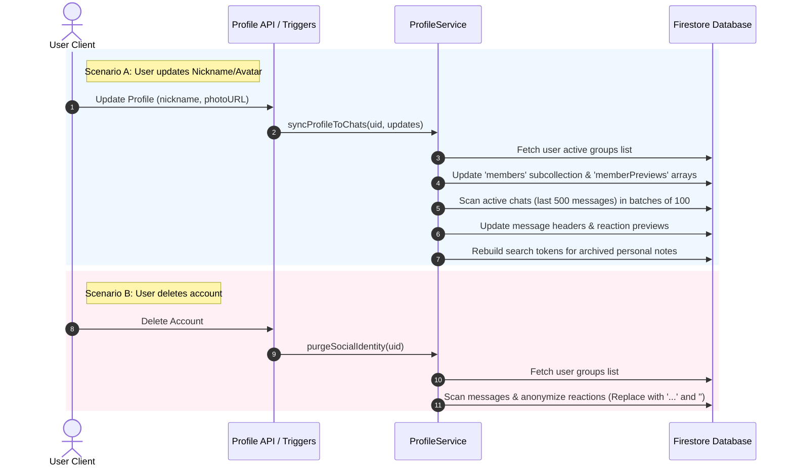

# User Profile Synchronization & Social Identity Purging Pipeline

To keep Serverless compute costs low and maintain strict privacy boundaries, **scripture-habit** implements a highly optimized user profile propagation and identity anonymization pipeline. 

Instead of performing costly global database scans or denormalizing all historical records, the backend utilizes **Exhaustive Batching**, **Active Chat Targeting**, and **Social Identity Purging** to balance UI consistency, performance, and user privacy.

---

## 🏗️ Core Architecture Overview

The system is managed by the serverless **`ProfileService`** (`api_internal/services/profile-service.ts`) which mediates two primary workflows:
1. **Profile Synchronization**: Propagates user profile updates (nickname and avatar photo) to active group environments and search engines.
2. **Social Identity Purging**: Redacts identifiable personal metadata from social interactions (reactions) when a user deletes their account, preserving chat structures without retaining PII (Personally Identifiable Information).



---

## ⚡ Profile Synchronization Engine

When a user changes their profile details, the changes must immediately propagate to group chats so that other members see correct names and avatars. However, scanning and updating years of old chat logs would cause an explosion in database read/write costs. 

To solve this, the `syncProfileToChats` method applies a **Targeted Active Horizon** policy:

### 1. Active Chat Targeting
Rather than scanning every message ever sent in a group, the engine restricts updates to the active horizon:
- **Maximum Threshold**: Evaluates up to a maximum of **500 recent messages** per group.
- **Pagination Scans**: Reads messages in pagination-controlled chunks of **100 documents** sorted by `createdAt` in descending order.
- **Early Break**: If a query returns no messages from that sender, it breaks early, saving compute and read costs.

### 2. Deep Reaction Previews Sync
Firestore messages contain a cached `reactionPreviews` map to render reactions instantly without executing subcollection joins:
```json
{
  "reactionPreviews": {
    "👍": [
      { "uid": "user_abc", "nickname": "John Doe", "photoURL": "https://..." }
    ]
  }
}
```
During the active horizon sweep, the service inspects this map:
1. It loops through each emoji category in `reactionPreviews`.
2. It locates matching reaction items by user `uid`.
3. It updates the cached `nickname` and `photoURL` inside that specific reaction item inline.
4. It updates the parent message document.

### 3. Rebuilding Search Indexes
Each personal study note contains a `searchTokens` array of normalized, space-delimited text prefixes for instant client autocompleting. The user's nickname is stored under `speaker`.
When a user updates their nickname:
1. The engine scans the user's personal `notes` subcollection in batches of 100.
2. For every matching note, it invokes the **`buildNoteSearchTokens`** helper to regenerate phonetic prefixes incorporating the new nickname.
3. This guarantees that autocompleting notes by "Speaker" remains 100% accurate.

---

## 🧹 Social Identity Purging (Anonymization)

Upon account deletion, compliance regulations (such as GDPR) require that personal data be completely expunged. However, simply deleting a user's messages or reactions would corrupt chat flows and confuse remaining group members.

The `purgeSocialIdentity` engine solves this by **anonymizing social interactions**:

```
[Active Message Reaction Previews]
  👍 Reaction: { uid: "user_123", nickname: "Alice Smith", photoUrl: "https://alice.jpg" }
                │
                ▼ (Account Deleted / Social Identity Purge Triggered)
  👍 Reaction: { uid: "user_123", nickname: "...", photoUrl: "" }
```

### The Anonymization Workflow
1. **Group Membership Check**: Reads the deleted user's profile to resolve their active group memberships.
2. **Exhaustive Reaction Scanning**: Loops through the messages of all associated groups.
3. **Identity Redaction**:
   - Locates any reaction preview belonging to the deleted user `uid`.
   - Replaces the user's personal `nickname` with a standardized placeholder (`"..."`).
   - Clears their personal avatar `photoURL` to an empty string (`""`).
4. **Data Integrity Preservation**:
   - The reaction counter stays intact.
   - Other users' reactions remain unaffected.
   - No PII is retained anywhere in the reaction metadata.

---

## 📦 Transactional Performance & Batch Management

To protect Firestore from rate limits and prevent Vercel Serverless Functions from hitting maximum execution timeouts, the synchronization engine enforces strict **Batching Safeguards**:

* **Firestore Operation Limit**: Firestore restricts batch operations to 500 writes.
* **450-Write Buffer**: The service operates with a conservative threshold of **450 operations per batch** (`currentBatchSize >= 450`).
* **Auto-Commit and Reset**: When the buffer is reached, the batch commits synchronously, resets the cursor, and begins a new transaction.
* **Lower Bound for Deletions**: Because deletions are intensive and prone to contention, the social identity purge batch commits at a lower threshold of **90 operations** to keep latency low.

> [!TIP]
> **Performance Optimization**: Profile updates utilize `db.getAll()` to retrieve metadata for all target groups in a single round-trip, minimizing network latency before starting the message iteration loop.
