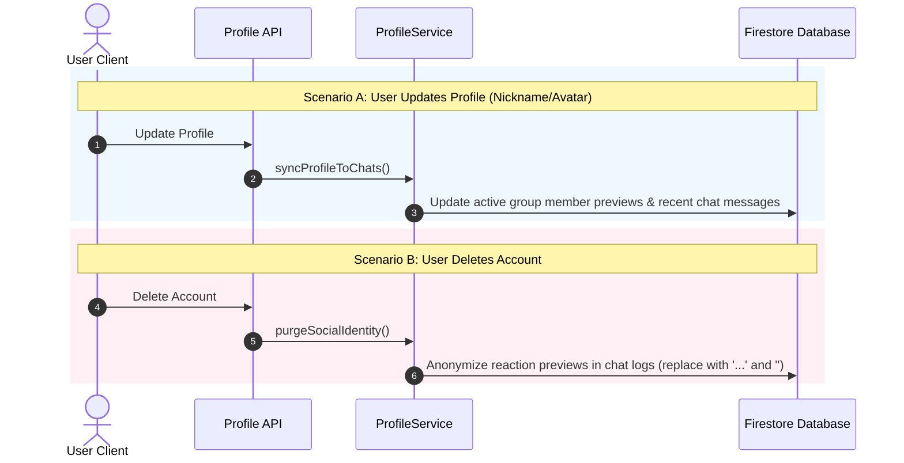

# User Profile Sync & Reaction Anonymization

This document details how profile updates (nickname, avatar) are synchronized to group chats and how personal data is anonymized upon account deletion.

---

## 1. Architecture Overview (`ProfileService`)

The serverless `ProfileService` (`api_internal/services/profile-service.ts`) handles two main workflows:



---

## 2. Profile Sync to Group Chats

Updating every historic message across all past groups would cause massive database write volumes. The sync engine balances performance and accuracy:

1. **Targeted Scan Horizon**: Scans recent active messages (up to 500 messages per group).
2. **Reaction Preview Updates**: Updates cached sender nicknames and avatars stored in `reactionPreviews`.
3. **Batching Safeguards**: Commits Firestore writes in chunks of 450 (well within Firestore's 500-write limit).

---

## 3. Account Deletion & Social Identity Anonymization

When an account is deleted, personal identifiable data must be removed, but deleting messages or reaction entries entirely would disrupt conversation context.

To solve this, the service **anonymizes reaction metadata**:

```
[Before Account Deletion]
  Reaction: { uid: "user_123", nickname: "Jane Doe", photoURL: "https://..." }
        │
        ▼ (Account Deletion Triggered)
[After Account Deletion]
  Reaction: { uid: "user_123", nickname: "...", photoURL: "" }
```

- **Personal Data Stripped**: The nickname becomes `"..."` and the avatar URL is emptied.
- **Chat Continuity Preserved**: Total reaction counts and message flows remain intact for other members.

---

## 4. Related Documentation

- [Group Chat Architecture & Implementation](./groupchat-construction-guide.md)
- [Database & Security](./database-security.md)
