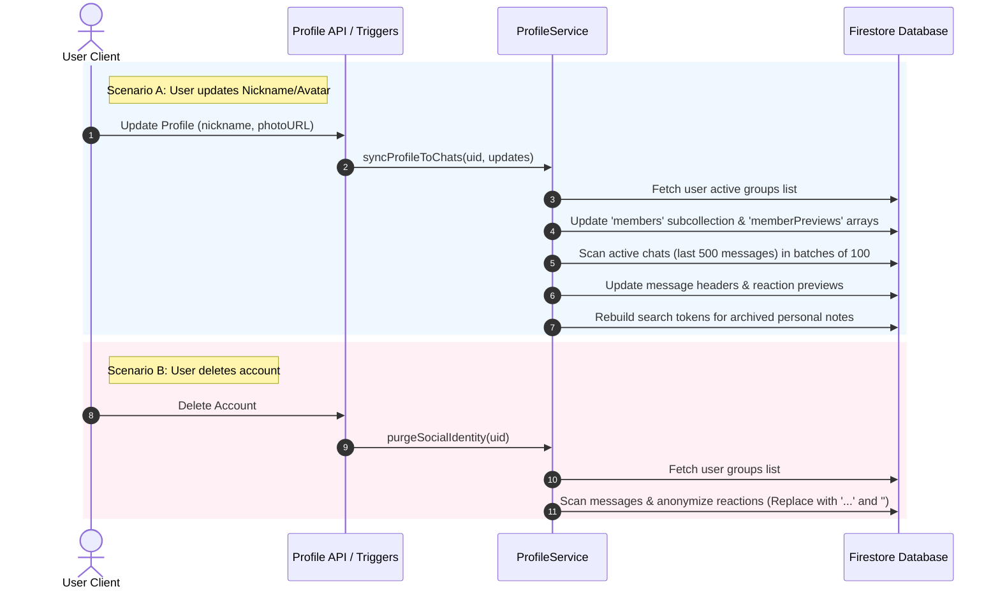

# User Profile Sync & Account Deletion Pipeline

This document explains how user profile changes (like nickname and avatar updates) are synchronized to group chats, and how personal data is anonymized when an account is deleted.

---

## Core Architecture Overview

The system is managed by the serverless **`ProfileService`** (`api_internal/services/profile-service.ts`), which handles two main workflows:
1. **Profile Synchronization**: Propagates profile updates (nickname and avatar photo) to active group environments and search indexes.
2. **Social Identity Purging**: Removes personal metadata from chat reactions when a user deletes their account. This preserves the chat history without retaining personal data.



---

## Profile Synchronization Engine

When a user changes their profile details, the changes must update in group chats so other members see correct names and avatars. However, updating all historical chat logs would be slow and expensive.

To solve this, `syncProfileToChats` applies an **Active Horizon** policy:

### 1. Active Chat Targeting
Instead of updating every message in a group, the engine limits the scope:
- **Maximum Limit**: Scans only the **500 most recent messages** per group.
- **Pagination**: Reads messages in chunks of **100 documents** sorted by `createdAt` in descending order.
- **Early Exit**: If a chunk contains no messages from the user, the sync stops early to reduce database costs.

### 2. Chat Reaction Previews Sync
Firestore messages cache a `reactionPreviews` map to render reactions instantly without additional database queries:
```json
{
  "reactionPreviews": {
    "👍": [
      { "uid": "user_abc", "nickname": "John Doe", "photoURL": "https://..." }
    ]
  }
}
```
During the update scan, the service updates this cache:
1. Loops through each emoji in `reactionPreviews`.
2. Locates matching reaction items by user `uid`.
3. Updates the cached `nickname` and `photoURL` inside that specific reaction item.
4. Saves the updated message document.

### 3. Syncing Message Search Tokens
Shared messages within group chats contain a `searchTokens` array including the title, book advice, comments, and speaker (preacher name, etc.). When a user updates their profile details, the sender's display name (`senderNickname`) and search metadata in group messages are propagated to maintain consistency across group search features.

---

## Social Identity Purging (Anonymization)

When a user deletes their account, personal data must be deleted. However, deleting their chat messages or reactions would break the conversation flow.

The `purgeSocialIdentity` engine solves this by **anonymizing social interactions**:

```
[Active Message Reaction Previews]
  Reaction: { uid: "user_123", nickname: "Alice Smith", photoUrl: "https://alice.jpg" }
                │
                ▼ (Account Deleted / Social Identity Purge Triggered)
  Reaction: { uid: "user_123", nickname: "...", photoUrl: "" }
```

### Anonymization Steps
1. **Active Groups Check**: Reads the deleted user's profile to find their active groups.
2. **Reaction Scanning**: Loops through all messages in those groups.
3. **Data Redaction**:
   - Locates any reaction preview belonging to the deleted user's `uid`.
   - Replaces the user's personal `nickname` with a placeholder (`"..."`).
   - Clears their `photoURL` to an empty string (`""`).
4. **Data Integrity**:
   - The reaction counts remain unchanged.
   - Other users' reactions are not affected.
   - No personal data is kept in the reaction details.

---

## Batch Management & Performance

To prevent Firestore rate limit errors and serverless function timeouts, the engine uses **Batching Safeguards**:

* **Firestore Limit**: Firestore restricts batch operations to 500 writes.
* **450-Write Buffer**: The service operates with a buffer of **450 operations per batch** (`currentBatchSize >= 450`).
* **Auto-Commit**: When the buffer limit is reached, the batch commits, resets, and begins a new transaction.
* **Deletion Threshold**: Because deletions are intensive, the social identity purge batch commits at a lower limit of **90 operations** to keep latency low.
