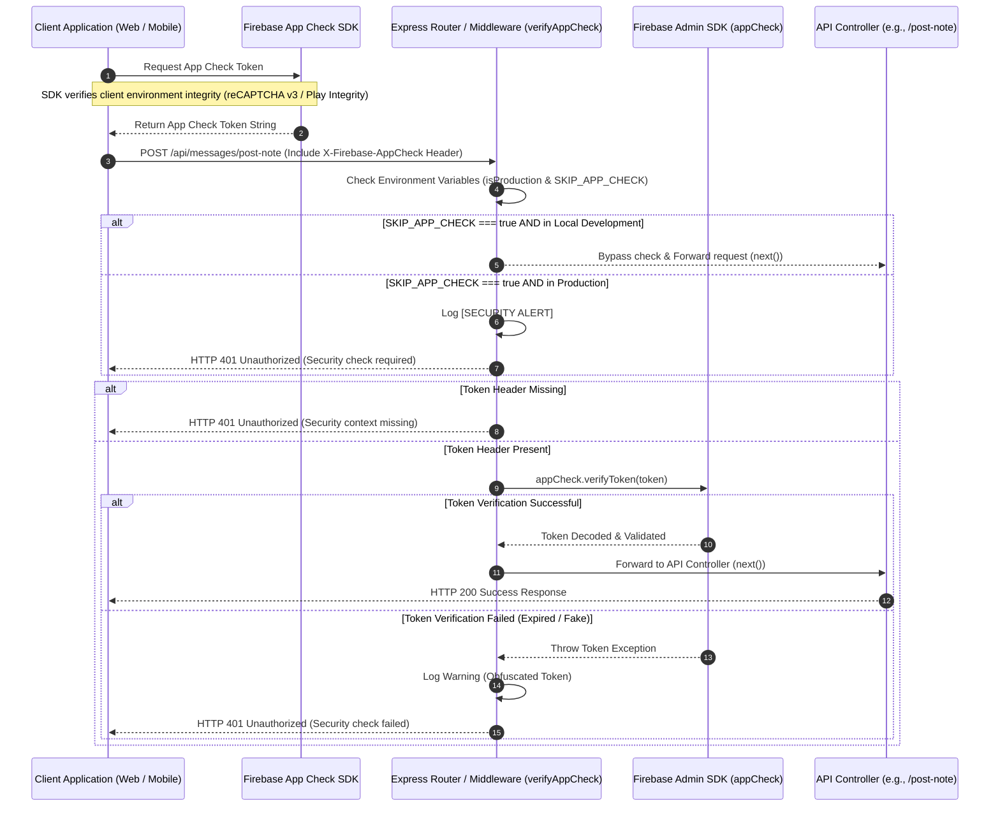

# App Check & API Protection Architecture

To protect backend resources from spam, scrapers, denial-of-service (DDoS) requests, and unauthorized API clients, **scripture-habit** integrates **Firebase App Check** as a gateway guard. 

App Check verifies that incoming HTTP requests come from real instances of our application (web or mobile) before running heavy operations like AI translations, group creations, or metadata parsing.

---

## 🛡️ Security Model: Two-Tier Protection

Our architecture uses a **Defense-in-Depth (多重防御)** strategy. Security is checked at two different boundaries: the **API Gateway Layer** (this document) and the **Database Security Rules Layer**.

```
Incoming Request  ──►  [ Tier 1: API Middleware ]  ──►  [ Tier 2: Database Rules ]  ──► Data Commit
                       - Express Router                 - firestore.rules
                       - verifyAppCheck                 - isAuthenticated()
                       - globalLimiter                  - isAppCheckVerified()
                       (This Document)                  (See firebase-security-rules.md)
```

1.  **Tier 1 (API Gateway - This Document)**: Protects resource-heavy endpoints and external APIs (such as Gemini AI, push notifications, and webpage scrapers). This gateway blocks invalid or spammy requests before they consume cloud server resources.
2.  **Tier 2 (Database Layer)**: Direct Firestore Security Rules act as a fallback. If a user tries to bypass our Express API by writing directly to Firestore using client SDKs, the database layer blocks the write. (See **[Firebase Security Rules & Write Isolation](firebase-security-rules.md)**).

---

## 🛡️ The App Check Gateway Flow

App Check operates as an interceptor middleware at the front of the backend router pipeline.



---

## 🔒 Security Gateways & Middleware Implementation

The core logic is in `api_internal/lib/middleware.ts` inside the `verifyAppCheck` middleware function.

### 1. Verification Logic
```typescript
export const verifyAppCheck = async (req: Request, res: Response, next: NextFunction) => {
    const isProduction = process.env.NODE_ENV === 'production';
    const skipRequested = process.env.SKIP_APP_CHECK === 'true';

    // 1. Strict Production Lockdown
    if (skipRequested) {
        if (isProduction) {
            console.error('[SECURITY ALERT] SKIP_APP_CHECK is enabled in production! This is forbidden.');
            return res.status(401).json({ error: 'Unauthorized: Security check required' });
        }
        console.warn('[AppCheck] Skipping verification (Development only)');
        return next();
    }

    // 2. Extract Token
    const token = req.header('X-Firebase-AppCheck');
    if (!token) {
        console.warn('[AppCheck] Security context missing from:', req.ip);
        return next(new AppError('Unauthorized: Security context missing', 401, 'APP_CHECK_MISSING'));
    }

    // 3. Verify via Firebase Admin SDK
    try {
        if (!appCheck) {
            throw new Error('Firebase App Check service is unavailable.');
        }
        await appCheck.verifyToken(token);
        next();
    } catch (err: unknown) {
        const error = err as Error;
        // Obfuscate the token in logs to protect user privacy
        console.warn('[AppCheck] Verification failed for token:', token.substring(0, 10) + '...', 'Error:', error.message);
        return next(new AppError('Unauthorized: Security check failed', error.message.includes('unavailable') ? 503 : 401, 'APP_CHECK_FAILED'));
    }
};
```

---

## ⚙️ Environment Strategies & Test Bypasses

Running security checks during automated testing and local development requires a flexible setup:

### 1. Local Development Bypasses
To allow developers to code and test APIs locally without generating signed app tokens:
*   **Configuration**: Add `SKIP_APP_CHECK=true` in `.env.local`.
*   **Security Guard**: The middleware enforces that if `NODE_ENV === 'production'`, any request to skip App Check throws a high-severity `[SECURITY ALERT]` log and blocks the request with `HTTP 401`.

### 2. Integration & End-to-End Testing (Vitest / Playwright)
*   **Vitest**: During integration testing, backend tests (e.g., `api_internal/routes/groups.integration.test.ts`) run in an environment where `SKIP_APP_CHECK=true` is set automatically.
*   **Playwright**: For browser end-to-end tests, Firebase provides **App Check Debug Providers**. The E2E environment injects a debug token into the browser context, which is verified by App Check as a test device.

---

## 🚦 Protected API Inventory

Most state-mutating or resource-heavy routes are protected by the `verifyAppCheck` middleware. Below is an inventory of routes protected by this gateway:

| Category | Endpoint | Protected Actions | Reason for Protection |
| :--- | :--- | :--- | :--- |
| **Authentication** | `POST /api/auth/update-profile` | Modifies user nicknames or settings. | Prevents bulk database spamming. |
| | `POST /api/auth/verify-login` | Resolves user sessions. | Secures session resolution gateways. |
| **Habit Loop** | `POST /api/messages/post-note` | Submits scripture notes, updates streaks, increments levels. | Stops streak forging and note spamming. |
| | `POST /api/messages/toggle-reaction` | Toggles message emoji reactions. | Prevents automated visual reaction floods. |
| **Group Admins** | `POST /api/groups/create-group` | Sets up new study groups. | Stops group exhaustion / resource bloating. |
| | `POST /api/groups/regenerate-invite` | Revokes and refreshes invite codes. | Blocks token exhaustion. |
| **AI Integration** | `POST /api/ai/translate` | Triggers LLM Translation jobs. | Protects from high LLM token costs. |
| | `POST /api/ai/generate-ponder-questions` | Prompts LLM for reflection items. | Prevents LLM billing inflation. |
| **Scrapers** | `GET /api/preview/fetch-church-metadata` | Fetches external webpage contents. | Blocks third-party scrapers using our SSRF proxies. |
