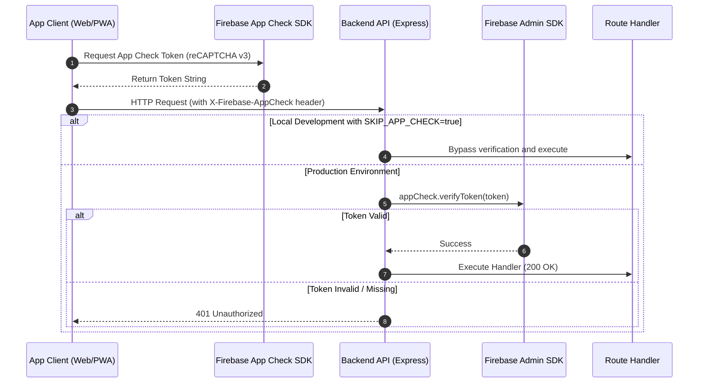

# App Check & API Protection Architecture

This document details how **Firebase App Check** safeguards backend resources from bots, scrapers, and unauthorized API clients.

---

## 1. Two-Tier Defense-in-Depth Model

Security is enforced at two distinct boundaries:

```
Incoming Request ──► [ Tier 1: API Gateway ] ──► [ Tier 2: Database Rules ] ──► Commit
                       - Express Middleware            - firestore.rules
                       - verifyAppCheck (App Check)    - isAuthenticated()
                       - Rate Limiters
```

1. **Tier 1 (API Gateway)**:
   Verifies that HTTP requests originate from legitimate app clients before executing resource-heavy operations (Gemini AI translation, push notifications, web scrapers).
2. **Tier 2 (Database Rules)**:
   Firestore security rules act as a strict database-level barrier if a client attempts to bypass the Express API.

---

## 2. App Check Verification Flow (`verifyAppCheck`)



---

## 3. Environment Configuration & Testing

- **Production (`production`)**:
  App Check verification is mandatory. If `SKIP_APP_CHECK=true` is accidentally set in production, the middleware blocks requests with a security alert.
- **Local Development (`development`)**:
  Setting `SKIP_APP_CHECK=true` in `.env.local` bypasses token checks for local testing.
- **E2E Testing (Playwright)**:
  Uses Firebase Debug Tokens injected into the browser context to authenticate automated test sessions.

---

## 4. Protected Endpoints Overview

| Category | Endpoint | Protection Objective |
| :--- | :--- | :--- |
| **AI Subsystem** | `/api/ai/translate`, `/api/ai/generate-personal-weekly-recap` | Prevents excessive LLM billing and abuse |
| **Study Activity** | `/api/notes`, `/api/messages/post-note` | Prevents streak manipulation and spam |
| **Group Operations** | `/api/groups/join-group`, `/api/groups/regenerate-invite-code` | Prevents brute-force invite scans and capacity bypasses |
| **URL Metadata** | `/api/preview/fetch-church-metadata` | Mitigates SSRF misuse and unauthorized scraping |

---

## 5. Related Documentation

- [Firebase Security Rules](./firebase-security-rules.md)
- [API Middleware & Error Handling](./api-middleware-error-handling.md)
- [Architecture Overview](./architecture.md)
