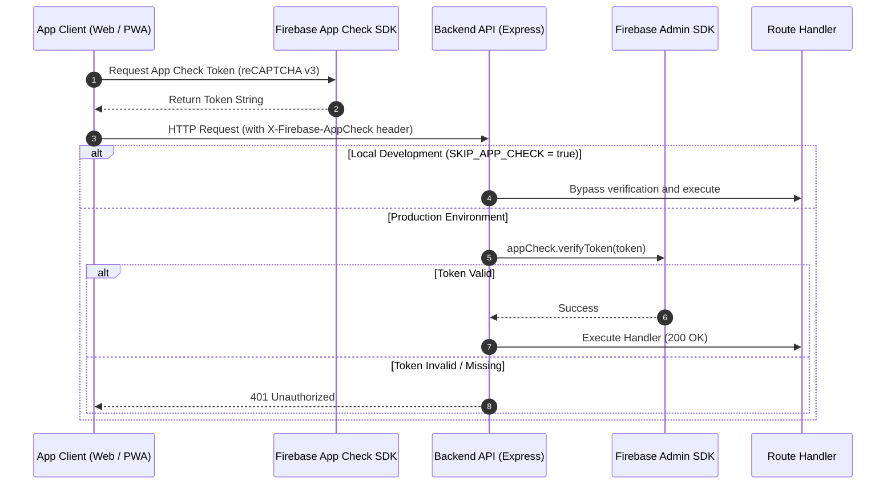

# App Check & API Protection Architecture

This document details how **Firebase App Check** safeguards backend resources against bot traffic, scrapers, and unauthorized API clients through a multi-tier defense model.

---

## 1. Two-Tier Defense-in-Depth Model

Security is enforced at two distinct infrastructural boundaries:

```
Incoming Request ──► [ Tier 1: API Gateway ] ──► [ Tier 2: Database Layer ] ──► Data Commit
                       - Express Middleware            - firestore.rules
                       - verifyAppCheck (App Check)    - isAuthenticated()
                       - Rate Limiters                 - allow write: if false; (Shared Data)
```

1. **Tier 1 (API Gateway)**:  
   Verifies that HTTP requests originate from genuine app clients before executing resource-intensive operations (Gemini AI translation, push notifications, web scrapers).
2. **Tier 2 (Database Layer)**:  
   Firestore Security Rules act as an immutable barrier if a client attempts to bypass the Express API and mutate Firestore directly.

---

## 2. App Check Verification Flow (`verifyAppCheck`)



### Verification Sequence Breakdown

1. **Client Token Acquisition**  
   The client-side Firebase App Check SDK interacts with reCAPTCHA v3 to acquire a signed token, appending it via the `X-Firebase-AppCheck` HTTP header.

2. **Server-Side Signature Validation**  
   The Express `verifyAppCheck` middleware extracts the header and validates cryptographic integrity and expiry via the Firebase Admin SDK.

3. **Early Request Termination**  
   Invalid or absent tokens immediately trigger a `401 Unauthorized` response before invoking downstream business logic or consuming LLM quotas.

---

## 3. Environment Configuration & Testing

- **Production (`production`)**:  
  Token verification is strictly enforced. If `SKIP_APP_CHECK=true` is inadvertently set in production, the middleware rejects requests with a critical security alert.
- **Local Development (`development`)**:  
  Setting `SKIP_APP_CHECK=true` in `.env.local` bypasses token validation for rapid iteration.
- **E2E Testing (Playwright)**:  
  Injects Firebase Debug Tokens into browser test contexts to authenticate automated test sessions.

---

## 4. Protected Endpoints Overview

| Category | Endpoint | Protection Objective |
| :--- | :--- | :--- |
| **AI Subsystem** | `/api/ai/translate`, `/api/ai/generate-personal-weekly-recap` | Prevents unauthorized LLM token billing and prompt spam |
| **Study Activity** | `/api/notes`, `/api/messages/post-note` | Prevents streak manipulation and automated note generation |
| **Group Operations** | `/api/groups/join-group`, `/api/groups/regenerate-invite-code` | Mitigates brute-force invite scans and capacity bypasses |
| **URL Metadata** | `/api/preview/fetch-church-metadata` | Prevents SSRF exploitation and proxy scraping |

---

## 5. Related Documentation

- [Firebase Security Rules](./firebase-security-rules.md)
- [API Design & Error Handling](./api-middleware-error-handling.md)
- [Architecture Overview](./architecture.md)
