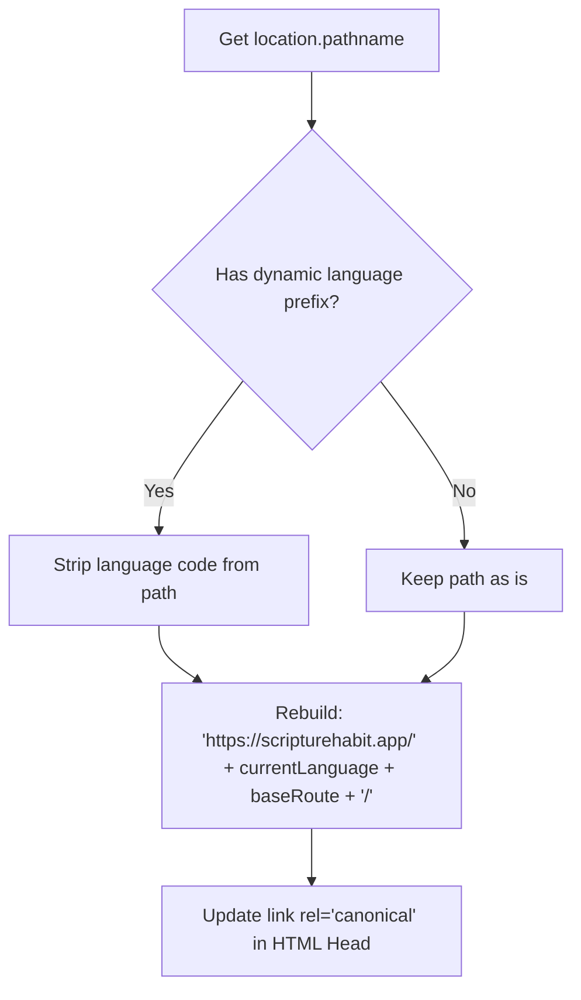

# SEO & OGP Dynamic Meta Management

This document describes the routing structure, metadata synchronization, and indexing settings managed by the **SEO & OGP Dynamic Meta Manager** component (`src/components/seo-manager.tsx`). 

This component maintains search engine listings and rich-media preview snippets (Open Graph) across multiple languages.

---

## 1. Multi-Lingual Route & Canonical URL Parsing

In a client-side Single Page Application (SPA), generating correct canonical paths for search engines is important, especially when routes are prefixed by dynamic language codes (e.g. `/ja/...`, `/en/...`).

### Root Normalization Flow
1. **Extraction**: The component reads the current route from React Router (`useLocation().pathname`).
2. **Prefix Matching**: Paths are split to verify if they are prefixed by any language registered under `SUPPORTED_LANGUAGES`.
3. **Canonical URL Generation**:
   * It extracts the logical web path (e.g., `/dashboard`).
   * It reconstructs a localized, standard canonical URL for the active language and ensures a trailing slash is appended to avoid duplicates:
     `https://scripturehabit.app/{language}{normalizedPath}/`
   * It updates the document's `<link rel="canonical" href="...">` element dynamically.



---

## 2. Robots & Indexing Settings (Privacy)

One of the most important aspects of SEO for private web apps is **excluding private pages** from search engines. 

`SEOManager` manages a robots meta tag injected into the document head, separating public pages from private pages:

| Route Parameter | Target Path Examples | Indexed? | Robots Directive | Rationale |
| :--- | :--- | :--- | :--- | :--- |
| **Public Core** | `/`, `/privacy`, `/terms`, `/legal` | **Yes** | `index, follow` | Drives organic traffic and maintains public legality terms. |
| **User Portal** | `/dashboard`, `/welcome` | **No** | `noindex, nofollow` | Avoids caching active portals or empty dynamic states. |
| **Auth Screen** | `/login`, `/signup`, `/forgot-password` | **No** | `noindex, nofollow` | Prevents exposing registration endpoints or blank pages. |
| **Group / Social**| `/group/*`, `/join/*` | **No** | `noindex, nofollow` | Protects private study logs and participant directory rosters. |
| **Personal Space**| `/profile`, `/my-notes`, `/settings` | **No** | `noindex, nofollow` | Strictly isolates user-specific data from scraping engines. |

### Dynamic Directive Application
The manager parses the primary route. If the route is private, it updates the header:
```typescript
robotsTag.setAttribute('content', 'noindex, nofollow');
```
If it is a public-facing route, it applies:
```typescript
robotsTag.setAttribute('content', 'index, follow');
```

---

## 3. Social Media Preview (OGP & Twitter Cards)

To ensure links shared on platforms like Slack, Facebook, LINE, and Twitter render thumbnails, social metadata is synchronized live.

### Synchronized Meta Properties
Whenever a route changes or a translation is modified, the manager reads values translated by `useLanguage` and writes to the DOM:

1. **Document Title (`document.title`)**:
   * Appends localized branding suffix (e.g. `Dashboard | Scripture Habit` or `Login | Scripture Habit`).
   * Propagates automatically to `og:title` and `twitter:title`.
2. **Metadata Description (`meta[name="description"]`)**:
   * Evaluates the active localized value (`t('seo.description')`) and populates `description`, `og:description`, and `twitter:description`.
3. **Google Site Name Optimization (`og:site_name`)**:
   * Google uses specific metadata to determine how the product name displays in search results.
   * `SEOManager` injects an `og:site_name` tag declaring `Scripture Habit` to ensure correct branding.
4. **Canonical URL Alignment (`og:url`)**:
   * Synthesizes with the localized Canonical URL so social crawlers resolve shares back to the standard multi-lingual page.
