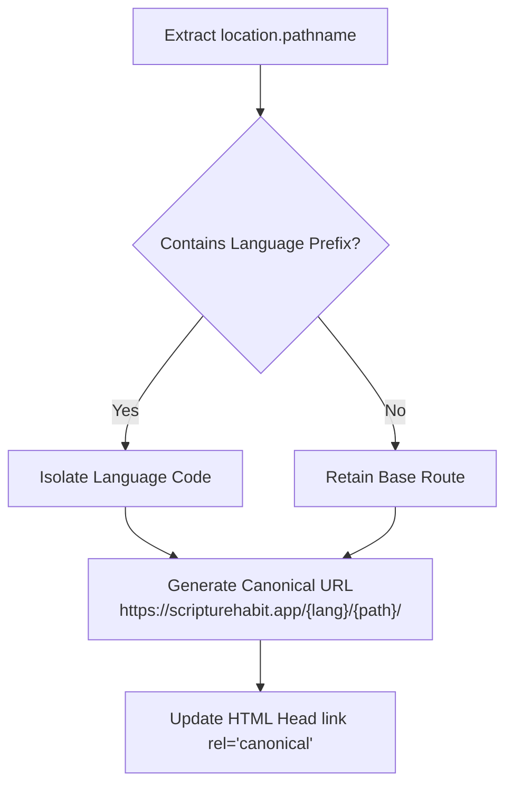

# SEO & Metadata Management

This document details canonical URL generation, search engine privacy policies (Robots tags), social media cards (OGP), and build-time localization.

---

## 1. Canonical URL Resolution

To help search engines recognize official pages across multilingual URL paths (`/ja/...`, `/en/...`), `SEOManager` (`src/components/seo-manager.tsx`) dynamically sets `<link rel="canonical">`.

---

## 2. Robots Directives & Privacy Protection

To prevent private user notes and group chat interactions from being indexed by search crawlers, robots directives are dynamically assigned per route:

| Route Category | Example Paths | Indexed? | Directive & Rationale |
| :--- | :--- | :---: | :--- |
| **Public Core** | `/`, `/privacy`, `/terms` | **Yes** | `index, follow` (Promotes search discovery) |
| **Dashboard** | `/dashboard`, `/welcome` | **No** | `noindex, nofollow` (Protects personalized portals) |
| **Authentication** | `/login`, `/signup` | **No** | `noindex, nofollow` (Prevents auth page caching) |
| **Groups & Chats** | `/group/*`, `/join/*` | **No** | `noindex, nofollow` (Protects private study records) |
| **Personal Spaces** | `/my-notes`, `/profile`, `/settings` | **No** | `noindex, nofollow` (Shields user notes from scrapers) |

---

## 3. Social Media Previews (OGP & Twitter Cards)

When links are shared on LINE, Slack, or X (Twitter), `SEOManager` evaluates localized metadata (`og:title`, `og:description`, `og:image`) based on the active language to ensure appropriate preview cards.

---

## 4. Build-Time Static HTML Pre-Localization

For crawlers and social preview bots that do not execute client-side JavaScript:
- **Build Pre-Generation (`scripts/localize-meta.ts`)**: Produces static HTML files for each supported language (`dist/index-ja.html`, `dist/index-es.html`, etc.) with pre-populated meta tags.
- **Server Rewrites (`vercel.json`)**: Automatically routes localized URLs (e.g. `/ja/*`) to `index-ja.html` on the server edge.

---

## 5. Related Documentation

- [Architecture Overview](./architecture.md)
- [Internationalization (i18n)](./logic-i18n.md)
- [Network & Performance Optimization](./network-performance-optimization.md)
