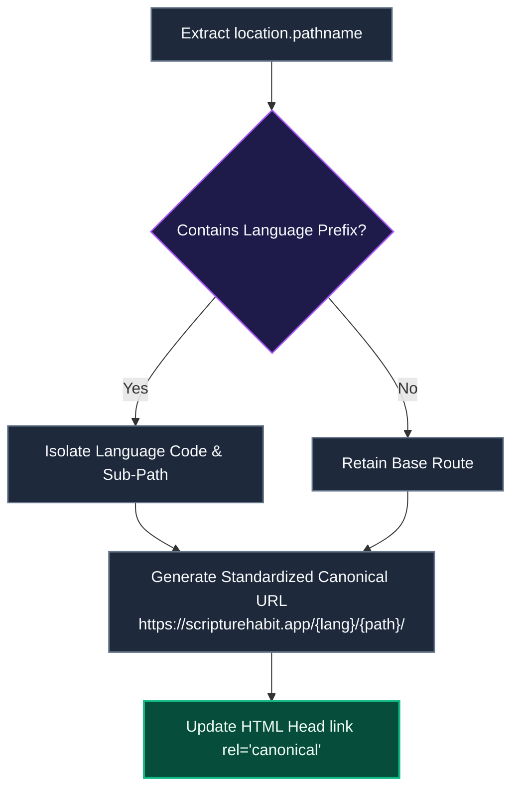

# SEO & Metadata Management

> [!TIP]
> **Interactive Architecture Tour**: [Open Live Tour (SEO & OpenGraph Meta Management)](https://htmlpreview.github.io/?https://github.com/ScriptureHabit/scripture-habit/blob/main/docs/public/architecture-tour.html?tour=tour-seo&lang=en)

This document details canonical URL generation, search privacy boundaries (Robots directives), social share cards (OGP), and build-time static HTML localization in Scripture Habit.

---

## 1. Canonical URL Resolution

To guide search crawlers across multilingual paths (`/ja/...`, `/en/...`), `SEOManager` (`src/components/seo-manager.tsx`) dynamically resolves `<link rel="canonical">`:

### Canonical Resolution Breakdown

1. **Path Normalization**  
   Extracts current browser routes and identifies whether a language prefix (`/ja/`, `/es/`) is present.

2. **Standardized URL Compilation**  
   Ensures uniform trailing slashes and absolute origins (`https://scripturehabit.app/...`).

3. **DOM Mutation**  
   Injects the resolved URL directly into the document `<head>`, consolidating indexing signals across language variations.

---

## 2. Robots Directives & Search Privacy

To protect personal reflections and private group discussions from public crawler indexing, robots meta tags are dynamically scoped per route:

| Route Category | Example Paths | Indexed? | Directive & Privacy Rationale |
| :--- | :--- | :---: | :--- |
| **Public Core** | `/`, `/privacy`, `/terms` | **Yes** | `index, follow` (Public landing and compliance pages) |
| **Dashboard** | `/dashboard`, `/welcome` | **No** | `noindex, nofollow` (Shields personalized study views) |
| **Authentication** | `/login`, `/signup` | **No** | `noindex, nofollow` (Prevents authentication caching) |
| **Groups & Chats** | `/group/*`, `/join/*` | **No** | `noindex, nofollow` (Protects member chat logs) |
| **Personal Library** | `/my-notes`, `/profile`, `/settings` | **No** | `noindex, nofollow` (Shields user notes from scrapers) |

---

## 3. Social Share Previews (OGP & Twitter Cards)

When links are shared across LINE, Slack, or X (Twitter), `SEOManager` populates Open Graph tags (`og:title`, `og:description`, `og:image`) according to the active language.

---

## 4. Build-Time Static HTML Pre-Localization

For crawlers and social scrapers that do not execute client JavaScript:
- **Build Pre-Generation (`scripts/localize-meta.ts`)**: Produces static HTML files per supported language (`dist/index-ja.html`, `dist/index-es.html`, etc.) with pre-populated meta tags.
- **Edge Routing (`vercel.json`)**: Server rules route localized paths (e.g., `/ja/*`) to corresponding pre-rendered HTML entrypoints.

---

## 5. Related Documentation

- [Architecture Overview](./architecture.md)
- [Internationalization (i18n)](./logic-i18n.md)
- [Network & Performance Optimization](./network-performance-optimization.md)
