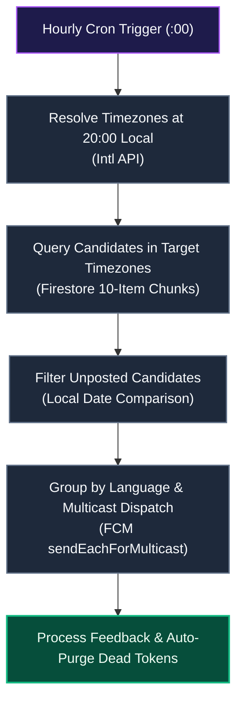

# Timezone-Aware Streak Reminders

This document details the scheduling pipeline, timezone resolution, and multicast delivery of localized evening push notifications (`api_internal/lib/streak-reminder.ts`) in Scripture Habit.

---

## 1. Pipeline Overview

Rather than broadcasting an uniform global notification, an hourly cron job identifies regions experiencing **8:00 PM (20:00) local time**, filters users with incomplete daily study, and dispatches localized push notifications.

### Pipeline Breakdown

1. **Dynamic Timezone Identification**  
   Evaluates all IANA timezones using Node.js's `Intl` API to locate regions currently at 20:00 local time (adjusting automatically for Daylight Saving Time).

2. **Chunked Firestore Queries**  
   Partitions eligible timezones into 10-item chunks to adhere to Firestore `in` query limits.

3. **Localized Completion Filtering**  
   Compares the candidate's `lastPostDate` against their local calendar date string (`YYYY-MM-DD`), filtering for uncompleted sessions.

4. **Multicast Dispatch & Self-Healing Purge**  
   Groups candidate tokens by language preference for batched FCM delivery, automatically purging invalidated tokens on failure feedback.

---

## 2. Timezone Resolution & Completion Evaluation

### ① Detecting 8:00 PM Timezones
Dynamically scans `Intl.supportedValuesOf('timeZone')` to identify zones whose current local hour is `20`.

### ② Localized Completion Verification
Derives the local `YYYY-MM-DD` string in the target timezone rather than UTC, comparing it against the user's `lastPostDate` to prevent erroneous reminder alerts.

---

## 3. Query Partitioning & Multicast Delivery

- **10-Item Query Partitioning**: Splits target timezones into 10-item arrays to satisfy Firestore operator constraints.
- **Multicast Grouping**: Bundles tokens by user language, dispatching in batches of up to 500 via `sendEachForMulticast`.

---

## 4. Automatic Token Purging

Tokens that fail delivery due to app uninstallation or expiration (e.g., `messaging/registration-token-not-registered`) are parsed from response arrays and deleted from Firestore.

---

## 5. Related Documentation

- [Push Notification System](./feature-notifications.md)
- [Maintenance & Scheduled Jobs (Cron)](./maintenance-cron.md)
- [Note Posting & Streak Logic](./logic-note-posting.md)
