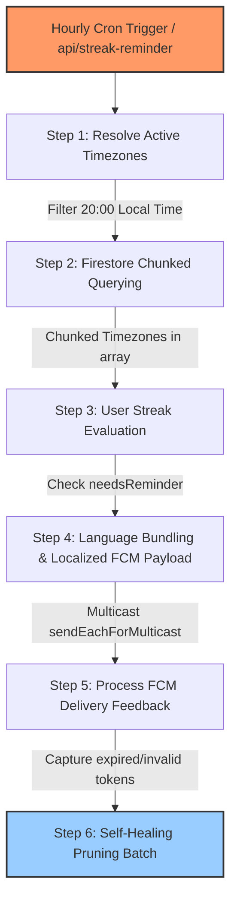

# Timezone-Aware Local Streak Reminder System

> [!WARNING]
> **TEMPORARILY DISABLED**: As of May 28, 2026, the timezone-aware daily streak warning reminder notifications logic in `/api/cron/streak-reminder` has been temporarily disabled (commented out) and bypassed to return mock stats. To re-enable, remove the bypass block from [`cron.ts`](../scripture-habit/api_internal/routes/cron.ts) and revert the skipped integration tests in [`cron.integration.test.ts`](../scripture-habit/api_internal/routes/cron.integration.test.ts) and [`streak-reminder.integration.test.ts`](../scripture-habit/api_internal/streak-reminder.integration.test.ts).

To support users worldwide, Scripture Habit has a timezone-aware streak reminder engine (`api_internal/lib/streak-reminder.ts` & `/api/streak-reminder` in `cron.ts`).

Instead of sending notifications to all users at a single UTC hour, the system runs hourly background checks, detects which timezones have reached **8:00 PM (20:00) local time**, and sends localized push notifications to users who have not finished their study for the day.

---

## 🏗️ Architecture Overview

The reminder process uses an hourly Cron trigger, the `Intl` API for timezone calculations, chunked Firestore queries, and Firebase Cloud Messaging (FCM) to send notifications:



---

## ⏰ Timezone Evaluation & Date Calculations

The core logic in `StreakReminderEngine` determines timezone offsets and daily completion status.

### 1. Finding Active Timezones
Rather than using static offsets (which fail during daylight saving time changes), the system uses the native JavaScript Internationalization API:
1. Fetches all standard global timezones using `Intl.supportedValuesOf('timeZone')`.
2. For each timezone, it creates a localized 24-hour formatter:
   ```typescript
   const formatter = new Intl.DateTimeFormat('en-US', {
       timeZone: tz,
       hour: 'numeric',
       hour12: false
   });
   ```
3. Formats the current UTC time. If the local hour is exactly `20` (8 PM local time), that timezone is added to the target list.
4. Midnight formatting values (which some engines render as `24`) are normalized to `0`.

### 2. Timezone-Aware Completion Check
To see if a user in a specific timezone has already completed their study, `needsReminder` performs a date comparison:
1. Converts the current UTC time into the user's local timezone date in the `sv-SE` format, which returns `YYYY-MM-DD`.
2. Compares this date string with the user's `lastPostDate` (which is also stored as `YYYY-MM-DD` based on their post timezone).
3. **Evaluation**:
   - If `lastPostDate === localizedToday`, the user has already posted today. It returns `false` (no reminder needed).
   - If they do not match, the user has not posted. It returns `true` (reminder needed).

---

## 🚦 Firestore Chunked Querying

Firestore limits `where(field, 'in', Array)` queries to a maximum of **10 array elements**. Since the list of active timezones reaching 8:00 PM at any hour often exceeds 10, the service partitions queries:

- **Partitioning**: The active timezone list is divided into arrays of 10 elements.
- **Parallel Queries**: The backend runs parallel Firestore reads for each chunk, searching for users where `timeZone in [tz_chunk]` and `hasFcmToken == true`.
- **Deduplication**: Combines the results into a single list of users who need reminders.

---

## 💬 Localized Push Notifications

Once target users are found, the system optimizes delivery to reduce latency:

### 1. Grouping by Language
To avoid sending notifications one by one, the system groups users by their preferred language code (e.g., `'en'` for English, `'ja'` for Japanese).

### 2. Translation (`t()` helper)
For each language group, the server translates the notification text:
- **Title**: `t(lang, 'notifications.streak_warning_title')`
- **Body**: `t(lang, 'notifications.streak_warning_body')`

### 3. Multicast Sending
Push notifications are sent using `messaging.sendEachForMulticast`, which accepts up to 500 tokens per call. If a group has more than 500 tokens, it is automatically chunked into multiple 500-token batches.

---

## 🩹 Stale Token Cleanup (Self-Healing)

When apps are uninstalled or tokens expire, "ghost tokens" remain in the database. Trying to send notifications to these tokens slows down the system.

The `/api/streak-reminder` endpoint automatically cleans these up using feedback:

1. **Status Checks**: The Firebase Admin SDK returns a detailed response array mapping each token to a success/failure status.
2. **Error Detection**: If a push fails, the system checks for these error codes:
   - `messaging/invalid-registration-token`
   - `messaging/registration-token-not-registered`
3. **User Resolution**: It maps the failed token index back to the user's Firestore Document ID (`uid`).
4. **Token Deletion**: A Firestore batch deletes the invalid token from the user's tokens subcollection (`users/{uid}/private/tokens/fcmTokens`) using `admin.firestore.FieldValue.arrayRemove`.
5. **Batch Limits**: Token deletions are committed in safe chunks of **400 write operations** at a time.

> [!IMPORTANT]
> **Safety Check**: If a user has no FCM tokens left after cleanup, the system updates their public user document to `hasFcmToken = false` to prevent redundant future lookups.
