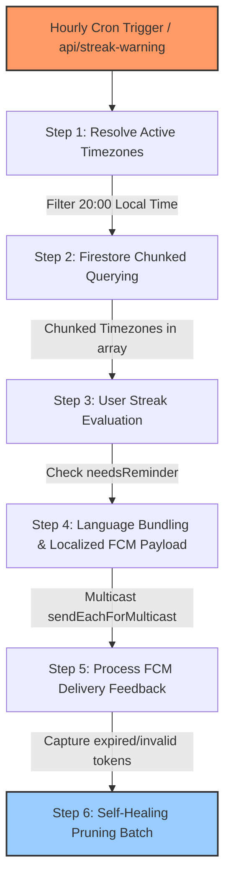

# Timezone-Aware Local Streak Reminder System

To support a global community of users, **scripture-habit** features a timezone-aware streak reminder engine (`api_internal/lib/streak-reminder.ts` & `/api/streak-warning` in `cron.ts`). 

Instead of spamming users at a single global UTC hour, the system runs hourly background checks, detects which timezones have reached exactly **8:00 PM (20:00) local time**, evaluates whether each user has completed their daily study, and delivers highly personalized, localized push alerts while maintaining database token health.

---

## 🏗️ Architectural Overview

The reminder pipeline utilizes an hourly Cron trigger, the `Intl` API for timezone math, batch query chunking, and Firebase Cloud Messaging (FCM) multicast dispatching with automatic self-healing.



---

## ⏰ Timezone Evaluation & Date Math

The core logic resides in `StreakReminderEngine` which evaluates timezone offsets and daily completion status.

### 1. Dynamic Timezone Targeting
Rather than maintaining static offsets (which fail during daylight saving time changes), the system uses the native Javascript Internationalization API to calculate matching local hours:
1. It fetches all standard global timezones using `Intl.supportedValuesOf('timeZone')`.
2. For each timezone, it constructs a localized 24-hour formatter:
   ```typescript
   const formatter = new Intl.DateTimeFormat('en-US', {
       timeZone: tz,
       hour: 'numeric',
       hour12: false
   });
   ```
3. It formats the current UTC time. If the resolved hour is exactly `20` (8 PM local time), that timezone is added to the active target list.
4. Normalization: Midnight formatting anomalies (which some Intl engines render as `24`) are normalized to `0`.

### 2. Timezone-Calibrated Completion Check
To check if a user in a specific timezone has already completed their scripture study today, `needsReminder` performs timezone-localized date comparisons:
1. It standardizes the current UTC time into the user's local timezone date using the Swedish locale `'sv-SE'`, which returns a consistent `YYYY-MM-DD` format.
2. It compares this localized date string against the user's `lastPostDate` (which is also stored in `YYYY-MM-DD` format based on their post timezone).
3. **Evaluation**:
   - If `lastPostDate === localizedToday`, the user has already posted today. `needsReminder` returns `false` (no reminder).
   - If it does not match, the user has not posted yet. It returns `true`.

---

## 🚦 Firestore Chunked Querying Strategy

Firestore imposes a structural constraint: `where(field, 'in', Array)` queries can contain a maximum of **10 array elements**. Since the list of active timezones reaching 8:00 PM at any given hour often exceeds 10 (especially in North American and Australian regions), the service implements **Chunked Query Array Partitioning**:

- **Chunking Loop**: The active timezone array is partitioned into sub-arrays of maximum size 10.
- **Parallel Queries**: The backend fires parallel Firestore reads for each chunk, querying for users matching `timeZone in [tz_chunk]` where `hasFcmToken == true`.
- **Deduplication**: Results are aggregated into a single list of eligible candidate users.

---

## 💬 Localized Multicast & Push Delivery

Once candidate users are gathered, the system optimizes delivery to reduce latency and provide localized messages:

### 1. Multi-lingual Bundling
To avoid firing individual notifications one by one, the system groups users by their preferred language code (e.g., `'en'` for English, `'ja'` for Japanese).

### 2. Localization Dispatch (`t()` helper)
For each language group, the server translates the notification payload:
- **Title**: `t(lang, 'notifications.streak_warning_title')`
- **Body**: `t(lang, 'notifications.streak_warning_body')`

### 3. FCM Multicast Chunks
Push notifications are dispatched using `messaging.sendEachForMulticast` which accepts up to 500 tokens in a single call. If a language group contains more than 500 tokens, it is automatically chunked into parallel 500-token batches.

---

## 🩹 Self-Healing Token Lifecycle (Ghost Buster Loop)

Mobile app uninstalls or device token expirations leave "ghost tokens" in the database. Trying to send pushes to these stale tokens degrades performance and wastes server resources. 

The `/api/streak-warning` endpoint incorporates a **self-healing feedback loop**:

1. **Granular Responses**: The Firebase Admin SDK returns a detailed response array mapping each token's index to a success/failure status.
2. **Stale Token Detection**: If a push fails, the system inspects the error code:
   - `messaging/invalid-registration-token`
   - `messaging/registration-token-not-registered`
3. **Reverse Identity Resolution**: It maps the failed token index back to the user's Firestore Document ID (`uid`) via a pre-constructed index map.
4. **Atomic Pruning**: A Firestore batch is built to remove the invalid token from the user's private subcollection (`users/{uid}/private/tokens/fcmTokens`) utilizing the atomic `admin.firestore.FieldValue.arrayRemove` operator.
5. **Batch Commitment Limit**: To prevent transactional locks, token deletions are batched and committed in safe chunks of **400 write operations** at a time.

> [!IMPORTANT]
> **Safety Guard**: If a user is resolved but has no FCM tokens remaining in their subcollection after pruning, the system preserves their profile but sets `hasFcmToken = false` on their public user document to prevent future redundant lookups.
