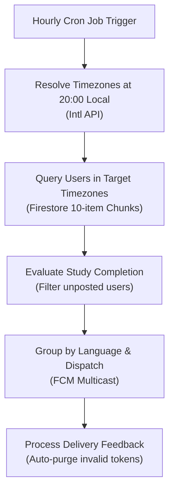

# Timezone-Aware Streak Reminders

This document describes how the application delivers localized evening push reminders according to each user's local timezone (`api_internal/lib/streak-reminder.ts`).

---

## 1. Pipeline Overview

Instead of broadcasting a single global notification at a fixed UTC time, an hourly cron job detects which regions have reached **8:00 PM (20:00) local time**, finds users who have not yet studied today, and dispatches localized push notifications.

---

## 2. Timezone Resolution & Completion Evaluation

### ① Detecting 8:00 PM Timezones
To seamlessly handle Daylight Saving Time changes, the engine dynamically checks `Intl.supportedValuesOf('timeZone')` to identify which zones are currently in their 20:00 hour.

### ② Localized Completion Check
Converts the current time into the user's local `YYYY-MM-DD` date string and compares it against their `lastPostDate`. If the user has not posted on their local calendar date, a reminder is scheduled.

---

## 3. Query Partitioning & Multicast Delivery

- **10-Item Query Chunks**: Partitions active timezones into batches of 10 to comply with Firestore's `in` query limits.
- **Multicast Grouping**: Bundles tokens by user language and sends notifications in batches of up to 500 via FCM `sendEachForMulticast`.

---

## 4. Automatic Token Purging

Stale or uninstalled FCM tokens (e.g. `messaging/registration-token-not-registered`) are automatically removed from the user's token list based on FCM delivery feedback.

---

## 5. Related Documentation

- [Push Notification System](./feature-notifications.md)
- [Maintenance & Scheduled Jobs (Cron)](./maintenance-cron.md)
- [Note Posting & Streak Logic](./logic-note-posting.md)
