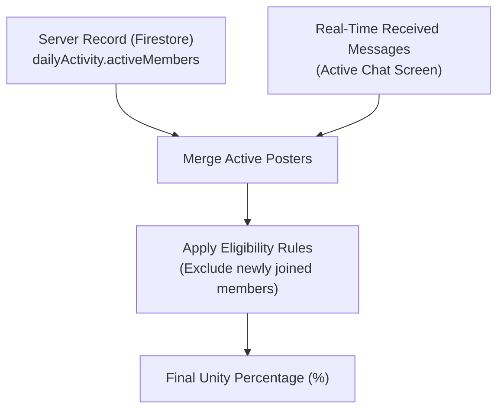

# Unity Participation & Sync Architecture

This document explains the mathematical formulas, eligibility criteria, and real-time synchronization mechanisms behind the **Unity Percentage** metric.

---

## 1. Core Concept

The Unity metric represents the percentage of eligible group members who have posted a study note on the current calendar day:

$$\text{Unity \%} = \frac{\text{Eligible Members Who Posted}}{\text{Total Eligible Members}} \times 100$$

Instead of fostering competition through individual leaderboards, Unity emphasizes shared team consistency.



---

## 2. Dual Data Source for Instant Updates

To ensure immediate visual feedback when notes are posted, `getUnityParticipation` aggregates data from two sources:

1. **Server Snapshot (`dailyActivity`)**: The official record of daily posters stored in the `/groups/{groupId}` document.
2. **Client Messages (`Message[]`)**: Real-time incoming messages in the active chat view. If a message has `isNote: true` matching today's date, the sender is counted immediately without waiting for server document round-trips.

---

## 3. Fair Eligibility Rules (Denominator Logic)

To prevent unfairly dragging down the group's percentage when a new member joins late in the evening:

> **Members who joined today are excluded from the denominator unless they have already posted a note.**

- **Joined today and posted**: Counted in both denominator and numerator (+1/+1).
- **Joined today and has not posted yet**: Excluded from the denominator (no penalty to the team).
- **Joined on a previous day**: Counted in the denominator as expected.

```mermaid
flowchart TD
    Start([Evaluate Member]) --> IsPoster{Posted today?}
    IsPoster -- Yes --> Counted([Eligible & Posted])
    IsPoster -- No --> JoinedDate{When did they join?}
    JoinedDate -- Before Today --> CountedEligible([Eligible (Not yet posted)])
    JoinedDate -- Today --> Excluded([Excluded from Denominator])
```

---

## 4. Timezone Alignment & Edge Cases

- **Group Timezone Anchor**: Evaluations use the group's configured `timeZone` (`group.timeZone`, default `'UTC'`) rather than individual member timezones.
- **Zero Eligible Members**: If no members are required to post (e.g. newly formed group with no prior-day members), the function returns `100%` to prevent division-by-zero.

---

## 5. Related Documentation

- [Small Group Dynamics (Max 5) & Peer Accountability](./ux-small-groups-and-peer-accountability.md)
- [Client-Side Unity Midnight Reset Hook](./client-unity-midnight-reset.md)
- [Group Chat Architecture & Implementation](./groupchat-construction-guide.md)
