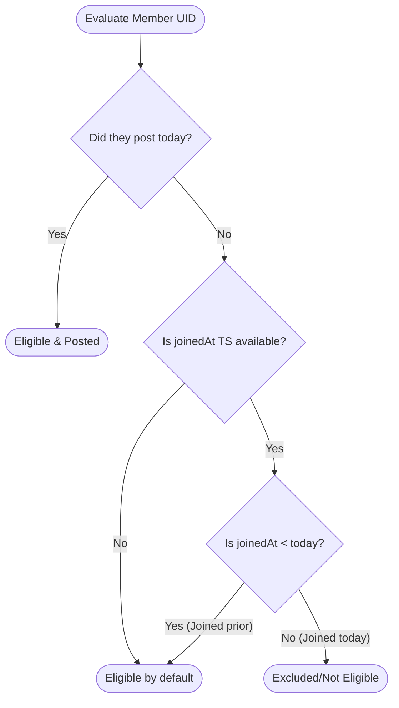

# Unity Participation & Sync Architecture

This document describes the design, math, data syncing, and calculations for **Unity (団結度)**. This metric represents the daily study completion status of a scripture reading group.

---

## 1. Core Concept

The Unity metric shows the percentage of eligible group members who have posted their scripture study notes for the current day. 

To keep the UI fast and responsive, the app combines **Server-side historical data** and **Client-side real-time messages** to calculate this metric instantly.

```
       ┌───────────────────────────────┐
       │   Group Document (Firestore)  │
       │   - dailyActivity.activeMembers│
       └──────────────┬────────────────┘
                       │
                       │ (Server Base)
                       ▼
             [ getUnityParticipation() ] ◄─── (Client Augmentation) ─── [ Real-time Chat Messages ]
                       │
                       ├──────────────────────────┐
                       ▼                          ▼
             [ Apply Eligibility Rules ]    [ Check Timezone / Date Alignment ]
                       │
                       ▼
             [ Final Unity Percentage ]
```

---

## 2. Dynamic Synchronization (Dual Data Sources)

To show instant updates when a user posts a note, `getUnityParticipation` aggregates active poster IDs from two data sources:

### Source A: Server-Side Snapshot (`dailyActivity`)
* **Location**: Loaded from the root `/groups/{groupId}` document.
* **Property**: `group.dailyActivity` containing `{ activeMembers: string[], date: string }`.
* **Behavior**: This is the official database record of users who posted today. It is updated inside a transaction when a note is submitted.

### Source B: Client-Side Messages (`Message[]`)
* **Location**: Fetched dynamically inside the active Group Chat screen.
* **Behavior**: When a user is in the chat screen and someone posts a note, a new message is received in the client state before the static group document updates.
* **Reconciliation**: The client scans these real-time messages. If a message has `isNote: true` and the date matches today in the group's timezone, the sender's UID is added to the posters list immediately, bypassing network delay.

---

## 3. Eligibility Logic (Edge Cases)

Calculating a fair percentage requires rules around who is required to post. For example, a new user joining a group at 11:59 PM should not drop the group's Unity percentage.

### Denominator Rule
The rule is:
> **Members who joined today are excluded from the required total (denominator) UNLESS they have already posted a note.**

If they have already posted today, they are counted as eligible and added to both the denominator and numerator. If they haven't posted yet, they do not penalize the group.



### joinedAt Fallback Resolver
To apply this rule, the app needs to know when the member joined. Because member data is structured differently across views, the algorithm uses a **three-tier fallback chain**:

1. **Primary**: `group.memberJoinedAt[uid]`
   * The global joined-at map stored on the group metadata document.
2. **Secondary**: `membersMap[uid].joinedAt`
   * The local map in the Group Chat view that resolves member metadata.
3. **Tertiary**: `group.myMemberStatus.joinedAt` (for current user)
   * The personal member status object parsed in the Sidebar context.

If no joining time is found after checking all three tiers, the member defaults to **Eligible** to avoid errors.

---

## 4. Timezone & Date Normalization

Because group members can reside in different countries, calculations are locked to the **group's specified timezone** (`group.timeZone` falling back to `UTC`).

1. **Date Parsing**: Timestamps are converted into local date strings (`YYYY-MM-DD`) matching the group's timezone using `formatDateInTimeZone()`.
2. **Comparison**:
   * The joining date is converted to a string.
   * A member is eligible if `normalizedJoinedDate < normalizedTodayDate`.
3. **Empty Base Cases**: If no members are eligible to post (e.g., in a group composed entirely of new members who joined today and have not yet posted), the algorithm returns **100% Unity** instead of dividing by zero.

---

## 5. Implementation Reference

The core logic is located in `src/utils/unity-utils.ts`:

```typescript
export const getUnityParticipation = (
  group: Group | null,
  messages: Message[] = [],
  referenceDate: Date = new Date(),
  membersMap?: MembersMap
): UnityParticipation => {
  // ... Core checks & dual source loading ...
  
  const eligibleMembers = uniqueMemberIds.filter(uid => {
    const isPoster = uniquePosters.has(uid);
    if (isPoster) return true; // Posted today -> count
    
    // Triple fallback resolver
    let joinedTs = memberJoinedAt[uid] || membersMap?.[uid]?.joinedAt || group.myMemberStatus?.joinedAt;
    if (!joinedTs) return true; // default fallback

    const joinedDateStr = formatDateInTimeZone(new Date(parseTimestampToMillis(joinedTs)), groupTimeZone);
    
    // Compare lexicographically: must have joined before today
    return normalizeDateString(joinedDateStr) < normalizeDateString(todayStr);
  });

  const postedMembers = eligibleMembers.filter(uid => uniquePosters.has(uid));
  
  if (eligibleMembers.length === 0) return { ..., percentage: 100 };
  
  const percentage = Math.round((postedMembers.length / eligibleMembers.length) * 100);
  return { eligibleMembers, postedMembers, notPostedMembers, percentage };
};
```
