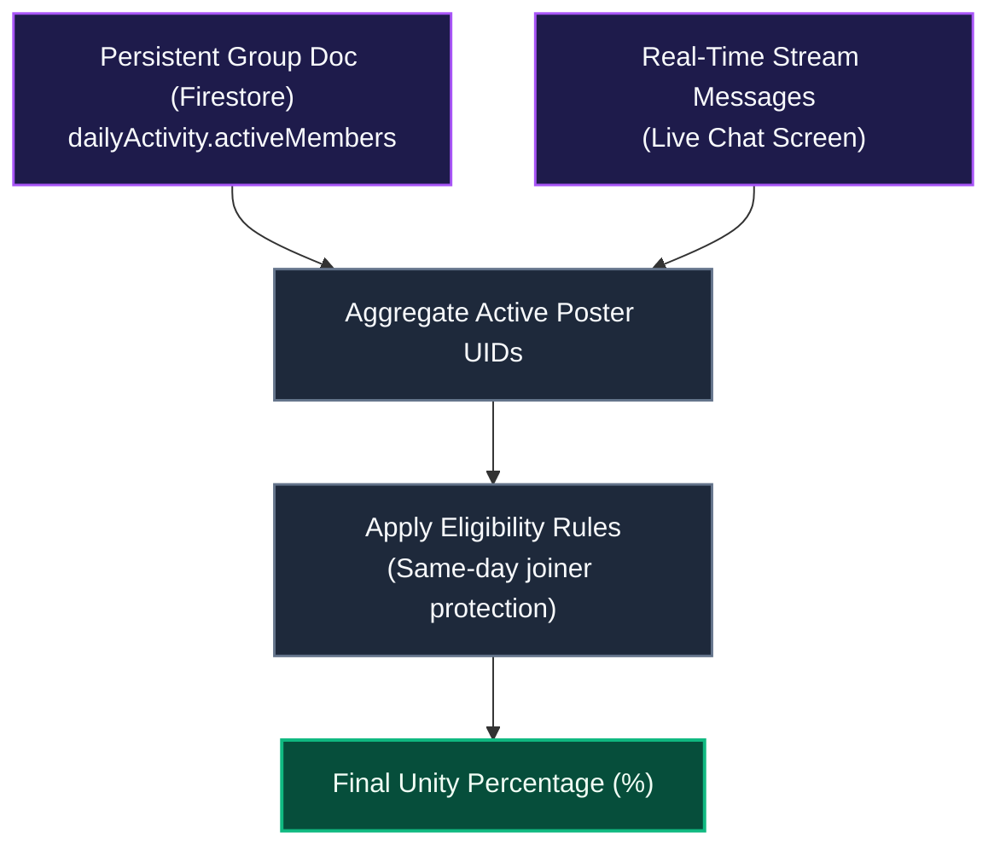
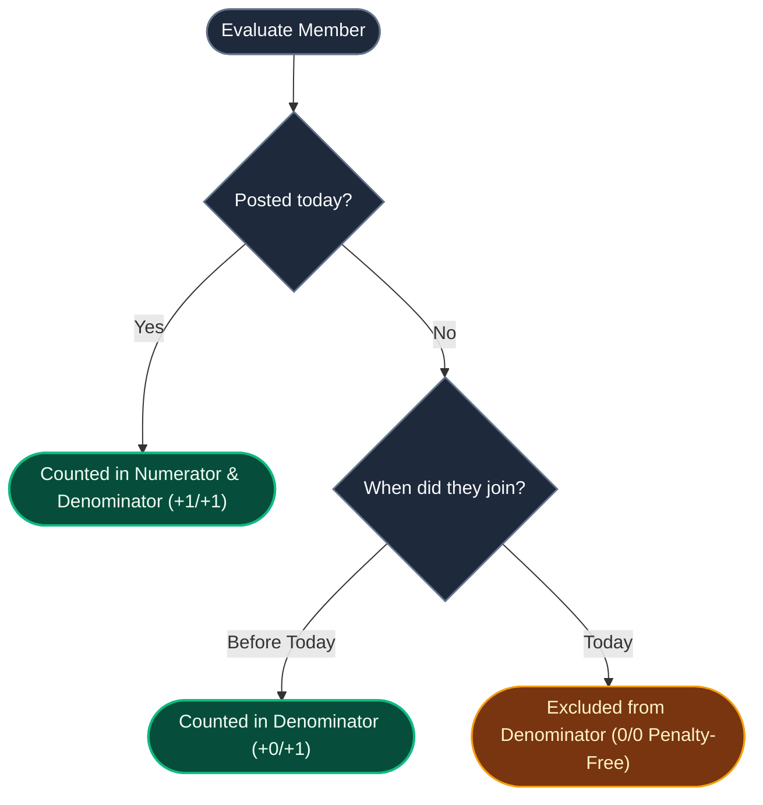

# Unity Participation & Sync Architecture

::: tip Interactive Architecture Tour
Explore the live data-flow blueprint and guided walkthrough for this feature:
- **Online (GitHub Browser Preview)**: [Open Interactive Tour (Group Chat & Unity Score)](https://htmlpreview.github.io/?https://github.com/ScriptureHabit/scripture-habit/blob/main/docs/public/architecture-tour.html?tour=tour-groupchat&lang=en)
- **VitePress / Local**: [Open Group Chat & Unity Score Tour](/architecture-tour.html?tour=tour-groupchat&lang=en)
:::

This document details the mathematical models, eligibility criteria, and real-time synchronization mechanisms underlying the **Unity Percentage** metric in Scripture Habit.

---

## 1. Core Concept

The Unity metric calculates the percentage of eligible group members who have successfully submitted a study note on the current calendar day:

$$\text{Unity \%} = \frac{\text{Eligible Members Who Posted}}{\text{Total Eligible Members}} \times 100$$

Rather than fostering rivalry via individual rank tables, Unity emphasizes collective consistency and mutual support.

### Aggregation Pipeline Breakdown

1. **Dual Data Source Ingestion**  
   Combines official server snapshots (`group.dailyActivity`) with incoming client messages (`isNote: true`) to deliver instant local responsiveness.
2. **Eligibility Filtering**  
   Evaluates each member's registration timestamp against the current date to prevent unfair penalty drops.
3. **Deterministic Derivation**  
   Computes the final completion percentage and broadcasts updates to UI components.

---

## 2. Dual Data Source for Real-Time Updates

1. **Server Snapshot (`group.dailyActivity`)**: The authoritative record of daily active posters stored on the Firestore group document.
2. **Client Stream Messages (`Message[]`)**: Live chat messages received during the active session. If a message contains `isNote: true` matching today's date, the author is counted immediately without waiting for server round-trips.

---

## 3. Fair Eligibility Rules (Denominator Logic)

To prevent newly joined members from dragging down a group's completion rate:

### Eligibility Logic Breakdown

- **Joined today and posted**: Included in both denominator and numerator (+1/+1).
- **Joined today and has not posted**: Excluded from the denominator, avoiding group penalties.
- **Joined prior to today**: Included in the denominator (+0/+1) as standard active members.

---

## 4. Timezone Alignment & Edge Cases

- **Group Timezone Anchor**: Evaluations use the group's configured `timeZone` (`group.timeZone`) rather than individual member offsets.
- **Zero Eligible Members**: When all members are same-day joiners who have not yet posted, the engine returns `100%` to prevent division-by-zero.

---

## 5. Related Documentation

- [Small Group Dynamics (Max 5) & Peer Accountability](./ux-small-groups-and-peer-accountability.md)
- [Client-Side Unity Midnight Reset Hook](./client-unity-midnight-reset.md)
- [Group Chat Architecture & Implementation](./groupchat-construction-guide.md)
