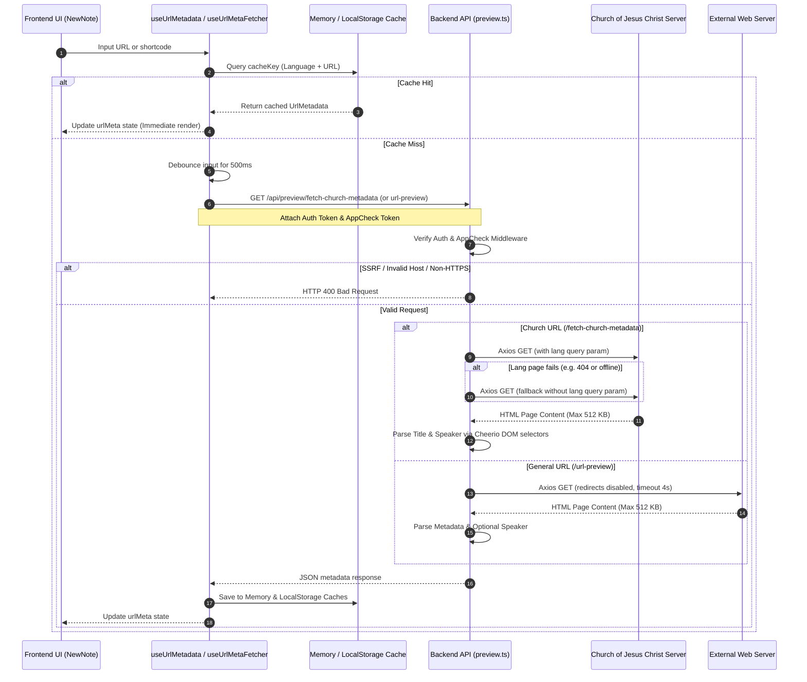

# URL Metadata & Speaker Extraction: Technical Deep-Dive

To provide a seamless, information-rich user experience, **scripture-habit** automatically extracts titles and speakers/authors from URLs (specifically Church of Jesus Christ of Latter-day Saints General Conference, Liahona, and BYU Speeches links) and general external web pages. This metadata enhances personal notes, aids in organization, and provides a polished interface when creating and viewing study notes.

---

## 🏗️ Architecture Overview

The metadata extraction architecture consists of a reactive React hook layer, a caching mechanism, and two backend API endpoints protected by Firebase security layers.

---

## 🔒 Security & Defense-in-Depth

Since fetching metadata requires the backend to perform server-to-server HTTP requests on behalf of users, multiple security measures are applied to prevent abuse:

1.  **Firebase Authentication Guard**:
    Every request to the metadata endpoints must include a valid Firebase ID Token in the `Authorization: Bearer <Token>` header, verified by backend middleware.
2.  **Firebase App Check Guard**:
    Protects API routes from automated abuse, scrapers, and botnets. The frontend obtains an App Check token using the Firebase Web SDK and transmits it in the `X-Firebase-AppCheck` header.
3.  **Server-Side Request Forgery (SSRF) Protection**:
    -   For `/fetch-church-metadata`, strict whitelisting is enforced: the hostname **must** exactly equal `www.churchofjesuschrist.org` or `churchofjesuschrist.org`, and the protocol **must** be `https:`.
    -   For `/url-preview`, the input is validated via `isSafeUrl(url)`, which prevents requests directed to internal network ranges (loopback, private subnets, link-local addresses).
4.  **Resource & Timeout Constraints**:
    -   **Content Length Limits**: Axios limits the downloaded payload to `512 KB` (`maxContentLength: 512 * 1024`) to block Denial of Service (DoS) attacks caused by loading excessively large binary or media files.
    -   **Timeouts**: Requests are constrained to `4000ms - 5000ms` to prevent server thread blocking.
    -   **Redirect Limits**: General URL preview has redirects disabled (`maxRedirects: 0`) to prevent redirect-based SSRF loops.

---

## 📡 Backend API Endpoints (`api_internal/routes/preview.ts`)

### 1. Church Metadata Endpoint (`/api/preview/fetch-church-metadata`)

Specifically optimized for parsing LDS content such as General Conference talks and Liahona articles.

*   **URL Requirements**: Host must be `churchofjesuschrist.org` / `www.churchofjesuschrist.org` and protocol must be `https:`.
*   **Language Parameters**: Translates application language codes to Church language parameters (e.g., Japanese `'ja'` maps to `'jpn'`).
*   **Dual-Fetch Fallback Strategy**:
    If a requested language variation fails (e.g., returning an HTTP error due to a non-existent translation), the system catches the error, deletes the `lang` parameter, and initiates a secondary fallback request. This ensures that the English page or fallback default is extracted rather than returning an error to the user.
*   **Cheerio Selectors (DOM Extraction)**:
    -   **Title Extraction**:
        1.  `meta[property="og:title"]` (content attribute)
        2.  First `<h1>` element
        3.  `<title>` tag
        *Cleanup: If the title contains a pipe separator `|` (e.g., `"Title | Ensign"`), it splits the string and retains only the first part.*
    -   **Speaker/Author Extraction**:
        1.  `div.byline p.author-name`
        2.  `p.author-name`
        3.  `a.author-name`
        4.  `div.byline p`
        *Cleanup: Employs a regex `^(By|Par|De|Por)\s+/i` to strip localized author prefixes in English ("By"), French ("Par"), Spanish ("De"), and Portuguese ("Por").*
*   **Fault Tolerance**: If the extraction completely fails, it returns an empty structure `{ title: '', speaker: '' }` with an HTTP 200 rather than throwing an error. This keeps the frontend note-saving form operational.

### 2. General URL Preview Endpoint (`/api/preview/url-preview`)

Generates rich previews for general links (e.g., news, blogs, and other resources).

*   **HTML Parsing & Metadata Selectors**:
    -   **Title**: `og:title` $\rightarrow$ `twitter:title` $\rightarrow$ First `<h1>` $\rightarrow$ `<title>`.
        *Cleanup: Splits and trims on standard separators like ` | ` and ` - `.*
    -   **Description**: `og:description` $\rightarrow$ `meta[name="description"]`.
    -   **Image**: `og:image` $\rightarrow$ `twitter:image`. Relative paths are converted to absolute URLs using the base page URL.
    -   **Favicon**: Resolves via Google’s high-quality favicon service:
        `https://www.google.com/s2/favicons?domain=${parsedUrl.hostname}&sz=64`
*   **Special Church URL Enhancement**:
    If the general URL preview detects that the site belongs to `churchofjesuschrist.org`, it attempts to find a speaker via Cheerio. If a speaker is found, and is not already part of the title, it appends it to the title in parentheses: `Title (Speaker)`.

---

## ⚡ Frontend Client Hooks

### 1. `useUrlMetadata` Hook (`src/hooks/use-url-metadata.ts`)

A highly optimized state hook used across the application to retrieve, manage, and cache metadata.

*   **Multi-Tier Caching System**:
    To minimize backend requests and network latency, a two-level caching system is used:
    1.  **Memory Cache (`memoryCache`)**: An in-memory JavaScript object mapping cache keys to metadata. Offers instant retrieval during active sessions.
    2.  **Local Storage Cache (`safeStorage`)**: Persists metadata across browser refreshes and sessions. Uses a safe wrapper that handles JSON serialization safely.
*   **Key Construction**:
    `url_meta_${language}_${urlOrSlug}`
*   **Header Enrichment**:
    Before sending the HTTP request, the hook concurrently attempts to fetch:
    -   The current Firebase User's ID token.
    -   The Firebase App Check token.
    If either fails, the hook prints a console warning in development but proceeds with the request, allowing graceful degradation.

### 2. `useUrlMetaFetcher` Hook (`src/components/newnote/hooks/use-url-meta-fetcher.ts`)

An integration-level hook dedicated to the note-creation modal (`NewNote`).

*   **Debounced Invocation**:
    Utilizes a `setTimeout` timer of **`500ms`** on input change. If a user is actively typing a URL, the fetch is delayed, avoiding rapid repetitive API requests.
*   **Contextual Triggering**:
    Only executes if the input is parsed as a valid URL/shortcode and the current selected scripture category is `"General Conference"`, `"BYU Speeches"`, or `"Other"`.

---

## 🧪 Testing & Verification

Comprehensive integration tests in `api_internal/routes/preview.integration.test.ts` ensure high code coverage and reliability:
-   **Authentication Checks**: Asserts that unauthenticated requests return `401 Unauthorized`.
-   **Validation Checks**: Verifies that invalid domains, HTTP schemes, or empty parameters return `400 Bad Request`.
-   **Mock Integration**: Uses `vitest` spy mechanics to intercept `axios.get` and inject mock HTML documents containing custom metadata.
-   **Fallback Validation**: Verifies that language fallback mechanisms correctly retry requests when an error is returned.
-   **SSRF Blockers**: Ensures that attempts to query private ranges (e.g. `http://127.0.0.1`) are caught by the safety layer.
