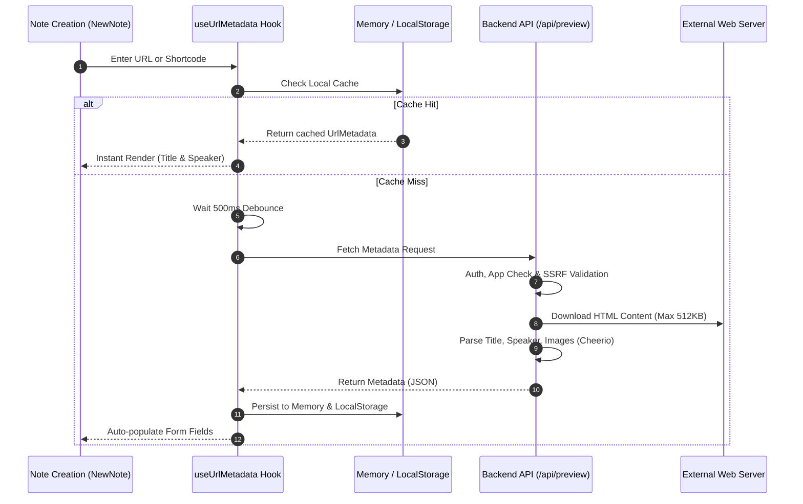

# URL Metadata & Speaker Extraction

This document details the metadata extraction pipeline, speaker identification algorithms, SSRF defense boundaries, and client-side caching mechanisms in Scripture Habit.

---

## 1. Pipeline Overview

When a user pastes a URL (General Conference talks, Liahona articles, BYU Speeches, or external resources) into a note, the system evaluates client caches, debounces input, enforces SSRF validations, and parses structured metadata:

### Extraction Sequence Breakdown

1. **Local Cache Evaluation & Debounce**  
   Checks memory and `localStorage` to return immediate preview matches. If missed, it applies a 500ms debounce to filter rapid typing.

2. **Security Verification & Safe Fetching**  
   Validates Firebase JWT and App Check credentials, enforces SSRF blocklists against private IP ranges, and streams up to 512KB over HTTPS.

3. **HTML Parsing & Storage**  
   Parses Open Graph tags, author prefixes ("By", "Par"), and speaker metadata via Cheerio, returning structured JSON to populate note fields.

---

## 2. Security Safeguards

1. **Authentication & App Check**: Enforces valid tokens on all preview endpoints.
2. **SSRF Mitigation**:
   - Church metadata (`/fetch-church-metadata`): Restricted strictly to `*.churchofjesuschrist.org` domains.
   - General URL preview (`/url-preview`): Validates DNS lookups against internal private network blocklists (loopback, link-local, private subnets).
3. **Bandwidth & Timeout Limits**:
   - Downloads are capped at `512 KB` to prevent resource exhaustion.
   - Socket requests enforce strict `4–5 second` timeouts.

---

## 3. Backend Endpoints (`api_internal/routes/preview.ts`)

### ① Church Content (`/api/preview/fetch-church-metadata`)
- **Language Parameter Fallback**: If fetching localized paths fails (e.g., `?lang=jpn`), it automatically retries without query parameters.
- **Speaker Normalization**: Strips localized prefixes ("By", "Par", "De", "Por") to extract clean speaker names.
- **Graceful Error Recovery**: Returns `{ title: '', speaker: '' }` on parse errors to ensure note submissions are never blocked.

### ② General Web Previews (`/api/preview/url-preview`)
Parses Open Graph tags (`og:title`, `og:description`, `og:image`) and HTML favicons.

---

## 4. Frontend Caching

- **Two-Tier Cache**: Memory cache for instant session rendering; `localStorage` for cross-session persistence.
- **500ms Debounce**: Bundles keystrokes to minimize server requests.

---

## 5. Related Documentation

- [Note Creation & Edit Modal Architecture](./newnote-construction-guide.md)
- [Gospel Library Scripture Mapper](./gospel-library-mapper.md)
