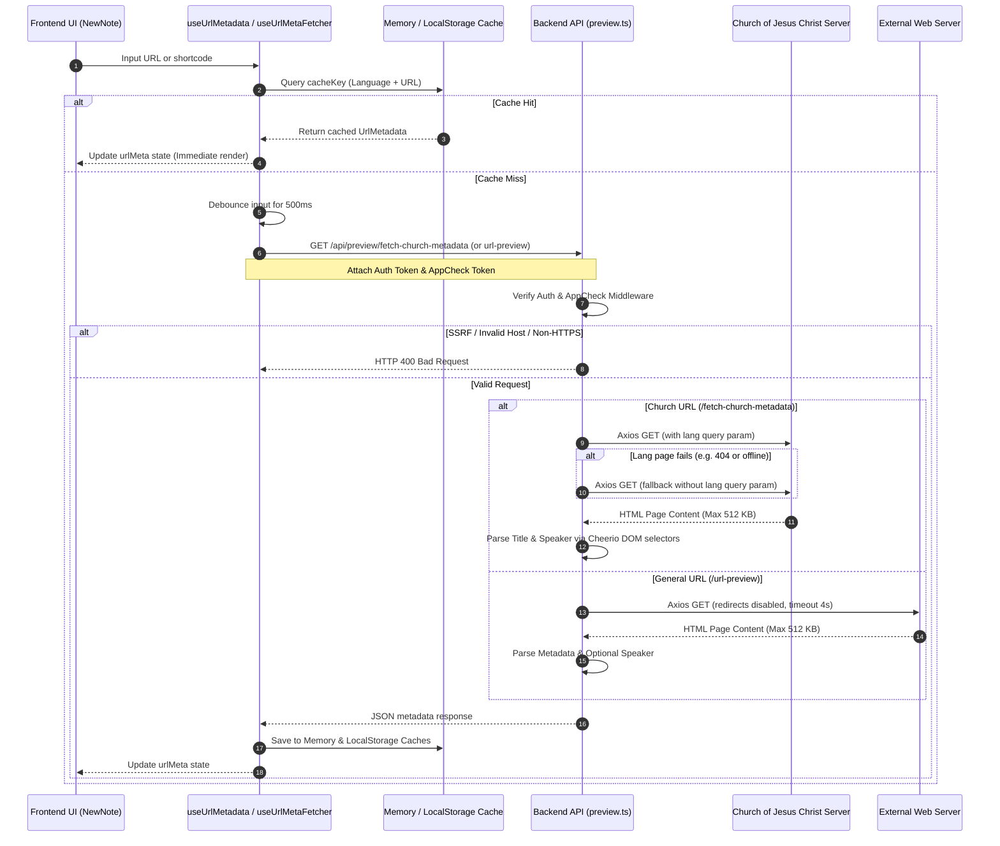

# URL Metadata & Speaker Extraction

This document explains how the app extracts page titles and speakers/authors from URLs (specifically General Conference, Liahona, BYU Speeches, and other web links) to enrich study notes.

---

## 🏗️ Architecture Overview

The metadata extraction uses a React hook, a caching layer, and two backend API endpoints protected by Firebase security middleware:

---

## 🔒 Security Measures

Because fetching metadata requires the server to make HTTP requests on behalf of users, multiple security measures are applied to prevent abuse:

1.  **Firebase Authentication Guard**:
    Every request to the metadata endpoints must include a valid Firebase ID Token in the `Authorization: Bearer <Token>` header.
2.  **Firebase App Check Guard**:
    Protects API routes from automated bots and scrapers. The frontend sends an App Check token in the `X-Firebase-AppCheck` header.
3.  **Server-Side Request Forgery (SSRF) Protection**:
    -   For `/fetch-church-metadata`, a strict whitelist is enforced: the hostname must be exactly `www.churchofjesuschrist.org` or `churchofjesuschrist.org`, and the protocol must be `https:`.
    -   For `/url-preview`, the input is checked via `isSafeUrl(url)` to prevent requests to local or private network ranges (like loopback or private subnets).
4.  **Resource Limits & Timeouts**:
    -   **Content Size Limits**: Axios limits the downloaded payload to `512 KB` to block Denial of Service (DoS) attacks from loading large files.
    -   **Timeouts**: Requests timeout after `4000ms - 5000ms` to prevent server blocking.
    -   **Redirect Limits**: Redirects are disabled (`maxRedirects: 0`) to prevent redirect-based SSRF loops.

---

## 📡 Backend API Endpoints (`api_internal/routes/preview.ts`)

### 1. Church Metadata (`/api/preview/fetch-church-metadata`)
Optimized for parsing LDS content like General Conference talks and Liahona articles.

*   **URL Rules**: Host must be `churchofjesuschrist.org` / `www.churchofjesuschrist.org` and protocol must be `https:`.
*   **Language Parameters**: Translates application language codes to Church language parameters (e.g., Japanese `'ja'` maps to `'jpn'`).
*   **Language Fallback**:
    If a localized page fails (e.g., returning an HTTP error), the system deletes the `lang` parameter and tries again without it. This ensures it extracts the English page or default version instead of failing.
*   **Cheerio Selectors (DOM Extraction)**:
    -   **Title**:
        1.  `meta[property="og:title"]` (content attribute)
        2.  First `<h1>` element
        3.  `<title>` tag
        *Cleanup: If the title contains a separator like `|` (e.g., "Title | Ensign"), it retains only the first part.*
    -   **Speaker/Author**:
        1.  `div.byline p.author-name`
        2.  `p.author-name`
        3.  `a.author-name`
        4.  `div.byline p`
        *Cleanup: Uses a regex to remove author prefixes like "By", "Par", "De", or "Por".*
*   **Failure Handing**: If extraction fails, it returns empty values `{ title: '', speaker: '' }` with an HTTP 200 so the frontend note-saving form still works.

### 2. General URL Preview (`/api/preview/url-preview`)
Extracts rich metadata previews for general website links.

*   **Metadata Selectors**:
    -   **Title**: `og:title` $\rightarrow$ `twitter:title` $\rightarrow$ First `<h1>` $\rightarrow$ `<title>`.
    -   **Description**: `og:description` $\rightarrow$ `meta[name="description"]`.
    -   **Image**: `og:image` $\rightarrow$ `twitter:image`. Relative paths are converted to absolute URLs.
    -   **Favicon**: Uses Google’s favicon service:
        `https://www.google.com/s2/favicons?domain=${parsedUrl.hostname}&sz=64`
*   **Church URL Support**:
    If a general URL belongs to `churchofjesuschrist.org`, it attempts to find a speaker. If a speaker is found, it appends it to the title in parentheses: `Title (Speaker)`.

---

## ⚡ Frontend Client Hooks

### 1. `useUrlMetadata` Hook (`src/hooks/use-url-metadata.ts`)
A custom React hook to retrieve, manage, and cache metadata.

*   **Two-Level Caching**:
    To minimize backend requests and network delay, the hook uses:
    1.  **Memory Cache**: Stores metadata in a JavaScript object for instant loading during the active session.
    2.  **Local Storage Cache**: Saves metadata to browser local storage so it remains after page refreshes.
*   **Cache Key Format**:
    `url_meta_${language}_${urlOrSlug}`
*   **Token Retrieval**:
    Before sending requests, the hook fetches the Firebase User ID token and Firebase App Check token. If they fail, it logs a warning in development and proceeds gracefully.

### 2. `useUrlMetaFetcher` Hook (`src/components/newnote/hooks/use-url-meta-fetcher.ts`)
An integration hook for the note-creation modal (`NewNote`).

*   **Debounced Input**:
    Delays the fetch request by **`500ms`** after typing. If the user keeps typing, the previous fetch is canceled, reducing API requests.
*   **Conditions**:
    Only runs if the input is a valid URL or shortcode, and the scripture category is `"General Conference"`, `"BYU Speeches"`, or `"Other"`.

---

## 🧪 Testing & Verification

Integration tests in `api_internal/routes/preview.integration.test.ts` verify the behavior:
-   **Authentication**: Asserts that requests without a token return `401 Unauthorized`.
-   **Validation**: Confirms that invalid domains or empty parameters return `400 Bad Request`.
-   **Mocks**: Uses `vitest` to mock `axios.get` and inject custom HTML pages for testing metadata parsing.
-   **Fallback**: Verifies that language fallback mechanisms work when errors occur.
-   **SSRF Block**: Confirms that attempts to query private IP ranges (e.g. `http://127.0.0.1`) are blocked.
