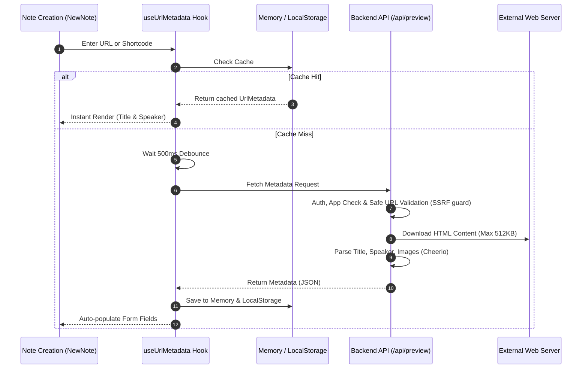

# URL Metadata & Speaker Extraction

This document explains how the application safely extracts page titles, authors/speakers, and thumbnail metadata when users input links (General Conference, Liahona, BYU Speeches, and external websites) in study notes.

---

## 1. Pipeline Overview

When a user inputs a URL, the system checks client-side caches, debounces input, validates security parameters, and fetches metadata server-side:

---

## 2. Security Safeguards

To protect against abuse and unauthorized network access, several safeguards are enforced:

1. **Authentication & App Check**: Requests must include valid Firebase Auth and App Check tokens.
2. **SSRF Protection**:
   - Church metadata (`/fetch-church-metadata`): Restricted to `churchofjesuschrist.org` domains via HTTPS.
   - General URL preview (`/url-preview`): Validates URLs against private network blocklists (preventing loopback/internal IP requests).
3. **Payload Limits & Timeouts**:
   - Downloads are capped at `512 KB` to avoid resource exhaustion.
   - Requests timeout within `4–5 seconds` to avoid hanging threads.

---

## 3. Backend Endpoints (`api_internal/routes/preview.ts`)

### ① Church Content (`/api/preview/fetch-church-metadata`)
Optimized for General Conference talks and Liahona articles:
- **Language Fallback**: If fetching a localized version (e.g. `?lang=jpn`) fails, it automatically retries without the language parameter to retrieve the default version.
- **Author Cleansing**: Automatically strips prefixes like "By", "Par", or "De" to cleanly extract author names.
- **Graceful Error Handling**: Returns `{ title: '', speaker: '' }` on parse errors so form submission is never blocked.

### ② General Websites (`/api/preview/url-preview`)
Extracts Open Graph metadata (`og:title`, `og:description`, `og:image`) and favicons from general web links.

---

## 4. Frontend Caching

- **Two-Tier Cache**:
  1. **Memory Cache**: Instant rendering during active sessions.
  2. **LocalStorage**: Persists parsed metadata across page reloads.
- **500ms Debounce**: Batches rapid typing to avoid firing excessive API requests.

---

## 5. Related Documentation

- [Note Creation & Edit Modal Architecture](./newnote-construction-guide.md)
- [Gospel Library Scripture Mapper](./gospel-library-mapper.md)
