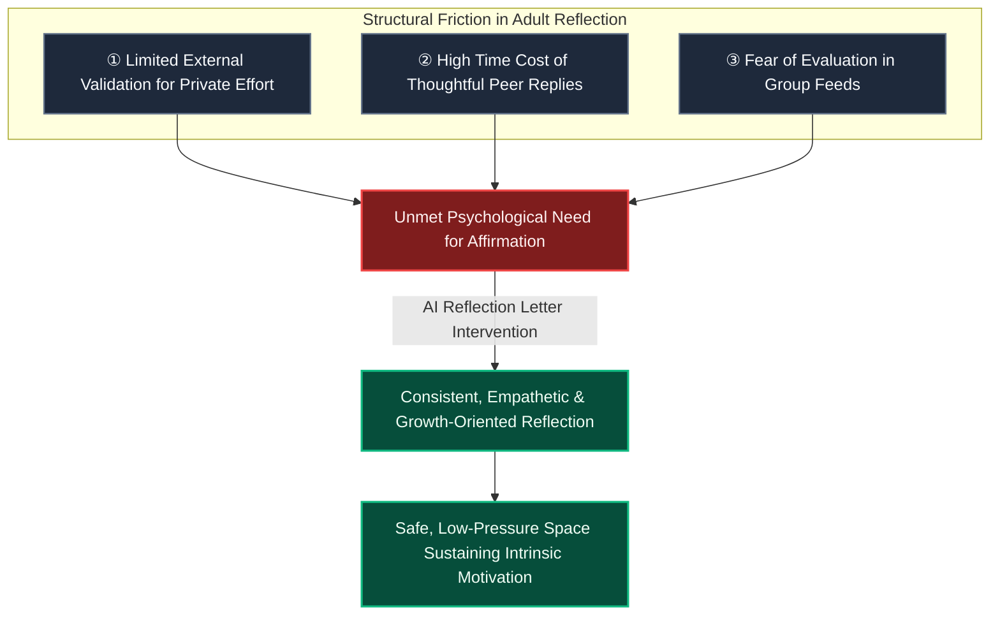

# AI Reflection Letters & Retention Psychology

> [!TIP]
> **Interactive Architecture Tour**: [Open Live Tour (Habit Recap & Reflections)](https://htmlpreview.github.io/?https://github.com/ScriptureHabit/scripture-habit/blob/main/docs/public/architecture-tour.html?tour=tour-recap&lang=en)

During user research interviews, learners consistently noted that beyond cumulative day tallies or group feeds, **"receiving personalized reflection letters from the AI provides immediate personal validation and serves as a primary driver of long-term engagement."**

This document examines the psychological principles and retention dynamics behind AI reflection letters.

---

## 1. Insights from User Feedback

The AI Reflection Letter pipeline (`api_internal/routes/ai.ts`) reviews recent study notes, contextualizes personal insights with scriptural narratives, and delivers encouragement in letter format.

> *"In adult life, it is rare for daily inner efforts to be explicitly acknowledged. Knowing my thoughts are received and thoughtfully responded to motivates me to write each day."*

Beyond simple text summarization, the core product value stems from **the reassurance of having one's private reflection heard, validated, and deepened**.

---

## 2. Psychological Realities of Adulthood

### Structural Gap Breakdown

1. **Validation Gap in Adulthood**  
   Fulfilling daily duties is assumed as baseline in adulthood, leaving little structural opportunity for personal spiritual introspection to receive validation.
2. **Bandwidth Limits in Human Groups**  
   In busy peer groups, composing in-depth responses to long personal reflections incurs high cognitive cost, condensing interactions to emojis.
3. **Unconditional Positive Regard via AI**  
   The AI provides an evaluative-free space, allowing users to express unpolished thoughts without fear of social judgment.

---

## 3. Psychological Mechanisms of Engagement

1. **Unconditional Positive Regard**  
   Consistently accepts user thoughts with warmth and dignity without critical evaluation.
2. **Psychological Mirroring & Clarification**  
   Synthesizes the core emotional and doctrinal themes of a note, connecting them with broader scriptural narratives to reinforce personal meaning.
3. **Lowering the Threshold for Self-Expression**  
   Removes anxiety around length, polish, or peer judgment, enabling users to record authentic thoughts.

---

## 4. Product Distinction

| Dimension | Conventional Study Apps | Scripture Habit (AI Reflection Letters) |
| :--- | :--- | :--- |
| **User Role** | Passive reading or checklist ticking | **Active writing and reflective dialogue** |
| **Feedback Mechanism** | Generic or non-existent | **Personalized letter tailored to user's notes** |
| **Retention Driver** | Fear of breaking a streak | **Intrinsic desire to reflect and read the next letter** |

---

## 5. Engineering Implementation & Church AI Guidelines Alignment

The generation prompt (`api_internal/routes/ai.ts`) aligns strictly with **General Handbook Section 38.8.47 ("Appropriate Use of Artificial Intelligence")**:

- **Persona Selection**: Connects characters from the Four Standard Works to studied chapters (e.g., 1 Nephi $\rightarrow$ Nephi, D&C 25 $\rightarrow$ Emma Smith), excluding the Savior and living leaders.
- **Two-Phase Progression**:
  1. **Phase 1 (Empathy & Relatability)**: Relatable human struggles and scriptural anecdotes build rapport.
  2. **Phase 2 (Christ-Centered Reflection)**: Shifts to a reverent, sincere tone validating faith and testimony.
- **Transparency & Disclaimers**: Clarifies AI roleplay at greeting and sign-off, affirming that letters do not replace personal revelation.
- **Word of Wisdom Adherence**: Forbids references to prohibited substances (coffee, tea, alcohol), utilizing wholesome daily habits instead.
- **LetterBox Archive**: Persisted in `src/components/letterbox/letter-box.tsx` for lifelong personal review.

---

## 6. Related Documentation

- [Small Group Dynamics (Max 5) & Peer Accountability](./ux-small-groups-and-peer-accountability.md)
- [Milestone Celebrations & Retention Psychology](./logic-milestone-retention.md)
- [AI Integration (Gemini)](./feature-ai-integration.md)
- [Dashboard & MyNotes Guide](./dashboard-mynotes-construction-guide.md)
