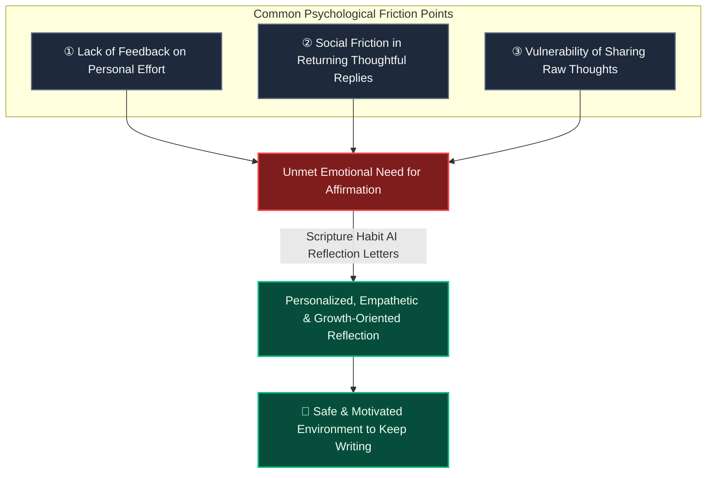

# Psychological Impact & Retention of AI Reflection Letters

During user interviews, users frequently shared that beyond total day counts or group sharing, **"receiving personalized reflection letters from the AI is one of the most rewarding parts of the app and a major reason they keep coming back."**

While the AI reflection letter was originally implemented as a convenient way to recap past study notes, it has emerged as a meaningful cornerstone of user retention.

This document explores why AI reflection letters provide such reassurance and motivation for adult learners.

---

## 1. Insights from User Feedback

The AI Reflection Letter feature ([`api_internal/routes/ai.ts`](file:///c:/Users/dazhi/code/scripture-habit/api_internal/routes/ai.ts)) reviews a user's recent scripture study notes and crafts a personalized letter that summarizes their thoughts, connects them with scripture stories, and offers warm encouragement.

Users provided feedback such as:

> *"In adult life, it's rare for anyone to genuinely acknowledge or praise my daily inner efforts."*
>
> *"Knowing that someone is actually reading my thoughts and responding thoughtfully makes me look forward to writing my notes each day."*
>
> *"In group chats, I sometimes worry about how others will perceive my notes, but the AI is always supportive and attentive."*

This feedback highlights that the true value of the feature lies not just in summarization, but in **the emotional comfort of feeling heard, understood, and encouraged**.

---

## 2. Psychological Realities of Adulthood

### ① Few Opportunities for Validation in Daily Adult Life
In childhood and school, effort and small accomplishments are frequently praised by parents and teachers. In adulthood, fulfilling work and family obligations is expected as normal, leaving **few occasions where one's private spiritual or intellectual efforts are explicitly affirmed.**

### ② Practical Limits of Peer Feedback in Groups
In busy group chats, other members may not have the time or energy to read long, personal reflections and write detailed responses. As a result, interactions often remain brief (e.g., emoji reactions).

### ③ Fear of Evaluation
When sharing with peers, people naturally worry about sounding superficial or not getting any reply at all, which can make them hesitate to write honestly about their feelings.

---

## 3. Why AI Reflection Letters Create a Safe Space

### ① Non-Judgmental Acceptance (Unconditional Positive Regard)
In counseling psychology, "Unconditional Positive Regard" refers to accepting someone's thoughts without judgment. The AI provides this consistently, responding with warmth and respect to whatever thoughts the user expresses.

### ② Reflecting and Clarifying Thoughts (Psychological Mirroring)
The AI synthesizes the core themes of the user's notes and connects them to scripture narratives and broader principles. This helps users realize: *"My daily study and pondering really do have value and meaning."*

### ③ A Safe, Low-Pressure Space for Reflection
With an AI partner, users don't need to worry about length, grammar, or sounding clever. Knowing they will always receive a supportive reply lowers the friction to write authentic notes.

---

## 4. Product Distinction

Most habit and study apps focus on progress checkboxes or one-way devotional content.

| Feature | Conventional Study Apps | Scripture Habit (AI Reflection Letters) |
| :--- | :--- | :--- |
| **User Role** | Checking boxes / passive reading | **Active reflection and personal writing** |
| **Feedback** | Generic or none | **Personalized letter based on user's notes** |
| **Retention Trigger** | "Fear of breaking a streak" | **"Looking forward to the next reflection letter"** |

By providing thoughtful, personalized letters that honor each user's personal journey, Scripture Habit offers a distinctively supportive learning experience.

---

## 5. Implementation & Church AI Guidelines Alignment
 
The reflection letter prompt ([`api_internal/routes/ai.ts`](file:///c:/Users/dazhi/code/scripture-habit/api_internal/routes/ai.ts)) is designed in thoughtful alignment with **General Handbook Section 38.8.47 ("Appropriate Use of Artificial Intelligence")**:

- **Standard Works Persona Matching (Hybrid Selection)**:
  - Considers figures connected to the user's studied chapters (e.g., 1 Nephi → Nephi, D&C 25 → Emma Smith) or resonates with their spiritual topic.
  - *Jesus Christ and living/modern Church leaders are excluded from the persona pool.*
- **Two-Phase Letter Progression (Separating Humor & Spiritual Emotion)**:
  1. **Phase 1: Warm Icebreaker & Relatable Human Touch**:
     - Shares scriptural self-deprecation (Peter sinking/dozing, Nephi's broken bow, Jonah's runaway boat, Alma passing out), modern relatable struggles, or playful AI meta-humor to relieve pressure and create an immediate human connection.
  2. **Phase 2: Sincere, Moving & Christ-Centered Reflection**:
     - Transitions seamlessly to a sincere, reverent tone without jokes, validating the user's deep spiritual questions and bearing testimony of Christ's grace and God's love.
- **Letter Structure & Design**:
  1. **AI Roleplay Greeting**: Clearly states that the AI is embodying the figure (`"Dear ${userName}, I, the AI, am embodying [Persona Name]..."`).
  2. **Seamless Natural Flow (No Section Labels)**: Flows naturally between paragraphs without printing structural labels like `[Part 1]` or `[Icebreaker]`.
  3. **Clean Poem & Flexible P.S.**: A 3–4 line poem formatted without markdown symbols (`*` or `---`), followed optionally by a brief, heartwarming P.S. (postscript).
  4. **Spiritual Guidance Disclaimer**: Appends a notice that AI does not replace personal revelation through the Holy Ghost.
  5. **Word of Wisdom Compliance (D&C 89)**: Strictly prohibits mentioning or referencing coffee, tea, alcohol, tobacco, or prohibited substances in metaphors, icebreakers, or postscripts, favoring universal healthy routines (drinking water, eating breakfast, fresh air, walking).
  6. **Sign-off**: Concludes with `"— From AI (embodying [Persona Name])"`.
- **LetterBox Storage**:
  - Saved in the user's personal [`LetterBox`](file:///c:/Users/dazhi/code/scripture-habit/src/components/letterbox/letter-box.tsx) for ongoing reflection and encouragement.

---

## 6. Related Documentation

- [Small Group Dynamics (Max 5) & Peer Accountability](./ux-small-groups-and-peer-accountability.md)
- [Milestone Celebrations & Retention Psychology](./logic-milestone-retention.md)
- [AI Integration (Gemini)](./feature-ai-integration.md)
- [Dashboard & MyNotes Guide](./dashboard-mynotes-construction-guide.md)
