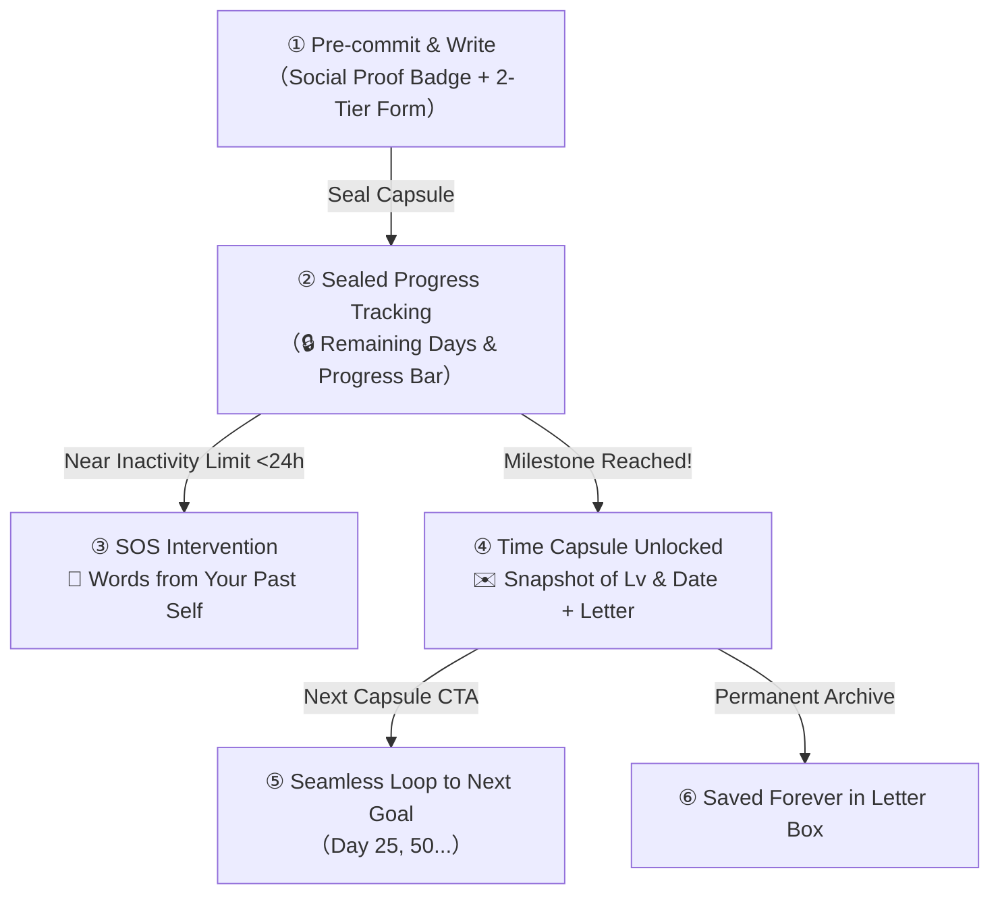

# Letters to Your Future Self (Time Capsule) & Habit Psychology

## Overview

The **Time Capsule (Letters to Future Self)** feature allows users to write and seal a personal encouragement letter and an emergency "SOS reminder" addressed to their future self upon reaching upcoming milestone targets (Day 10, 25, 50, 75, 100...).

Rather than serving as a simple note-taking mechanism, this feature is engineered around core behavioral psychology principles—specifically **Future Self Continuity** and **Pre-commitment Devices**—to transform daily scripture study into a resilient, lifelong habit.

---

## 🧠 Behavioral Psychology Principles

### 1. Strengthening Future Self Continuity
Psychological research reveals that individuals often view their future selves as disconnected strangers, leading to procrastination ("Future me can handle it").  
Writing a letter to one's future self bridges this emotional gap (**Future Self Continuity**). Users cultivate empathy and accountability toward their future self, significantly increasing their commitment to daily habits.

### 2. Pre-commitment Device
By drafting and "sealing" a letter for a specific future date (e.g., Day 10), users establish an internal psychological contract. The existence of a sealed, unopened time capsule creates strong intrinsic motivation: *"I must reach Day 10 to unlock what past-me wrote."*

### 3. Shift from External Validation to Self-Dialogue
While habits sustained purely by external peer approval are vulnerable to burnout, habits anchored in self-dialogue (*"My past self is cheering me on"*) build durable internal motivation independent of external circumstances.

---

## 🎨 5-Stage UX Journey Architecture

### ① Pre-commitment & Writing (`TimeCapsuleModal`)
*   **Social Proof Badge**:
    *   3+ achievers: `✨ {count} companions have achieved Day {days}!`
    *   Fewer than 3 achievers: `🌱 Companions around the world are aiming for Day {days}!`
    *   Alleviates isolation and boosts self-efficacy.
*   **2-Tier Structured Form**:
    1.  **Letter to Yourself on Day {days}** (Max 500 chars): Joy of accomplishment and encouragement.
    2.  **Emergency SOS Reminder** (Max 100 chars): Crisis prevention note (*"Remember why you started! Just one verse today is a win"*).
*   **Automatic Draft Sync**: Inputs are saved to local storage in real-time, preventing data loss on accidental dismissal.

### ② Sealed Progress Tracking (`TimeCapsuleCard`)
*   Prominently placed on the Dashboard with a soothing coral pink (`--pink: #FF919D`) progress bar and a remaining days badge (e.g., `あと 1日` / `1 day left`).
*   With every daily note submitted, the progress bar visibly fills, reinforcing a sense of steady progress.

### ③ SOS Crisis Intervention
*   When a user approaches a group inactivity deadline (< 24 hours remaining), the Dashboard card automatically transforms into an **"🚨 Words from Your Past Self"** banner.
*   Instead of a generic automated nag, the user receives their own heartfelt words written when they were inspired, gently prompting them to open the scriptures without guilt.

### ④ Milestone Unlocking Surprise (`TimeCapsuleUnlockModal`)
*   Reaching the target day unlocks the capsule with a celebratory stationery view.
*   **Past Snapshot**: Displays the creation date, study day count at the time, and level (e.g., `Written on: 2026.08.31 (Back then: Day 1 / Lv.1)`), providing concrete proof of personal growth.

### ⑤ Seamless Loop to the Next Target
*   The unlock modal concludes with a clear call-to-action: **"Write a Letter for Day {nextDays}"**, seamlessly channeling milestone momentum into the next habit loop.

### ⑥ Permanent Letter Box Archive
*   **While Sealed**: Hidden from the Letter Box to prevent spoilers.
*   **After Unlocking**: Permanently archived in the user's Letter Box (exempt from standard 30-day pruning), accessible as a lifelong treasure.

---

## 🔒 Privacy & Data Architecture

1.  **Strict Privacy Isolation**:
    *   Capsules are stored under `users/{uid}/letters/capsule_{targetDays}` with Firestore security rules restricting read access exclusively to the owner. Group members cannot view personal letters.
2.  **Efficient Count Aggregation**:
    *   Achiever counts for social proof leverage Firestore Server Aggregation (`getCountFromServer`) with in-memory caching to eliminate redundant reads.
