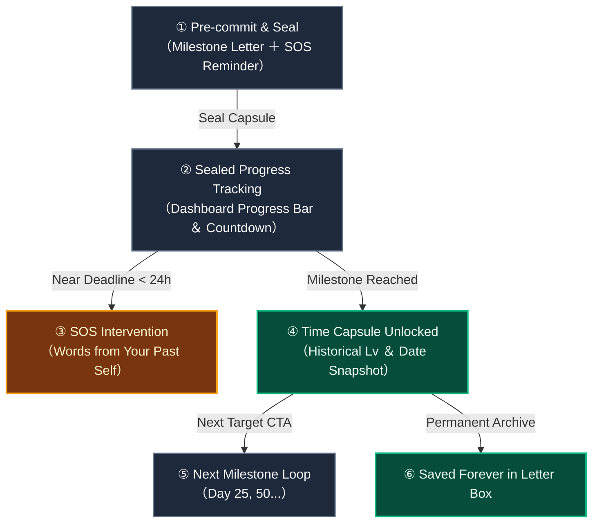

# Letters to Future Self (Time Capsule) & Habit Psychology

> [!TIP]
> **Interactive Architecture Tour**: [Open Live Tour (Time Capsule & Future Letters)](https://htmlpreview.github.io/?https://github.com/ScriptureHabit/scripture-habit/blob/main/docs/public/architecture-tour.html?tour=tour-timecapsule&lang=en)

The **Time Capsule (Letters to Future Self)** feature enables users to compose and seal encouragement letters and emergency SOS reminders addressed to their future self at upcoming milestone targets (Day 10, 25, 50, 75, 100...).

Grounded in **Future Self Continuity** and **Pre-commitment Devices**, this feature anchors daily scripture study into an intrinsically motivated habit loop.

---

## 1. Behavioral Psychology Principles

1. **Strengthening Future Self Continuity**  
   Bridges the cognitive gap where individuals view their future self as a detached stranger, fostering empathy and accountability toward future goals.
2. **Pre-commitment Devices**  
   Sealing a message for a specific future target creates a psychological contract, transforming milestone attainment into an intrinsic reward.
3. **Shift Toward Self-Dialogue**  
   Anchors habit motivation in private self-reflection (*"My past self is cheering me on"*) rather than external social approval.

---

## 2. 5-Stage UX Journey Architecture

### UX Journey Breakdown

1. **Pre-commit & Seal**  
   Users draft a milestone celebration letter (max 500 chars) and an emergency crisis reminder (max 100 chars), sealing it until the target day.
2. **Sealed Progress Tracking**  
   A dedicated dashboard progress bar advances with every daily note submission, visualizing steady progress toward the goal.
3. **SOS Crisis Intervention**  
   Approaching a group inactivity deadline replaces standard generic alerts with the user's own past words of encouragement.
4. **Milestone Unlocking**  
   Reaching the target day unlocks the capsule, displaying the user's past level and creation date to highlight personal growth.
5. **Continuous Loop & Permanent Archive**  
   The unlocked letter archives permanently into the Letter Box, seamlessly prompting creation of the next milestone capsule.

---

## 3. Privacy & Security Architecture

1. **Strict Privacy Isolation**  
   Letter documents (`content`, `sosMessage`) reside strictly within `users/{uid}/letters/capsule_{targetDays}`, accessible only by the authenticated owner.
2. **Server Aggregation Optimization**  
   Social proof counts utilize Firestore server aggregations (`getCountFromServer`) paired with in-memory caching to eliminate redundant reads.

---

## 4. Related Documentation

- [Milestone Celebrations & Retention Psychology](./logic-milestone-retention.md)
- [AI Reflection Letters & Retention Psychology](./ux-ai-reflection-letters.md)
- [Dashboard & MyNotes Guide](./dashboard-mynotes-construction-guide.md)
