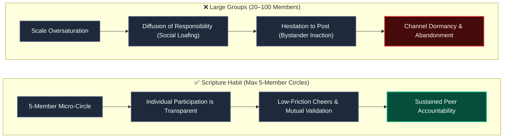
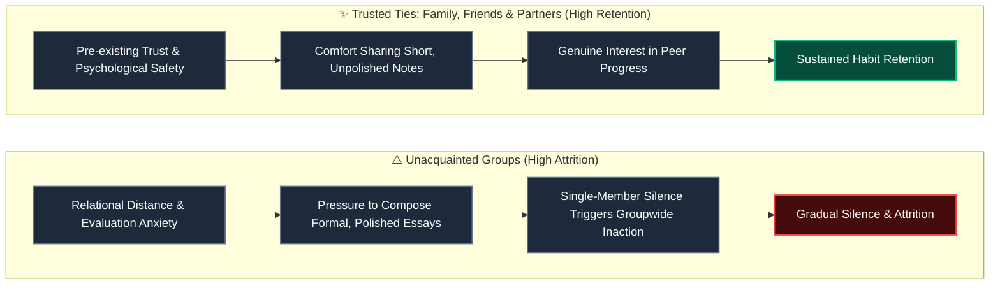

# Small Group Dynamics (Max 5) & Peer Accountability

Scripture Habit enforces a strict capacity limit of **5 members per group (`maxMembers: 5`)**.

Operational telemetry and user behavior demonstrate that **circles composed of trusted ties (family, partners, close friends) sustain high long-term retention, whereas groups of unacquainted strangers experience high attrition.**

This document details the psychological principles underlying the 5-member limit and the role of relational safety in habit formation.

---

## 1. Why Cap Groups at 5 Members?

In personal reflection and habit-building domains, oversized groups create psychological friction that degrades individual commitment:

### Scale Dynamics Breakdown

1. **Mitigating Social Loafing (The Ringelmann Effect)**  
   As group size increases, individual effort diminishes because members assume others will compensate. In a 5-person circle, every member's presence is visible, activating healthy peer accountability.

2. **Suppressing the Bystander Effect**  
   In large chatrooms, members assume someone else will reply, causing collective silence. Small groups foster an active environment where cheers and reactions circulate naturally.

3. **Dunbar’s Support Clique Capacity**  
   Anthropological research indicates the maximum number of close, unpretentious relationships an individual can maintain simultaneously is approximately 5.

---

## 2. Relational Safety and Retention Correlation

### Relational Context Breakdown

1. **Psychological Safety in Trusted Ties**  
   Pre-existing trust allows members to share quick, one-sentence reflections without fearing superficiality or judgment.

2. **Evaluation Anxiety Among Strangers**  
   Unacquainted groups induce pressure to compose polished essays, raising friction and causing missed days to cascade across members.

---

## 3. Product Architecture Alignment

| Architectural Choice | Objective & Behavioral Impact |
| :--- | :--- |
| **5-Member Hard Cap (`maxMembers: 5`)** | Prevents responsibility diffusion and keeps participation transparent. |
| **Direct Invite Links** | Empowers users to seed circles with established relationships. |
| **Dedicated AI Partner Circle** | Offers a private 1-on-1 space with the AI bot for users preferring individual study. |
| **Unity Percentage (Team Metric)** | Replaces individual leaderboards with a shared completion goal. |
| **Automated Inactivity Purging** | Removes dormant accounts to keep remaining active members engaged. |

---

## 4. Related Documentation

- [AI Reflection Letters & Retention Psychology](./ux-ai-reflection-letters.md)
- [Milestone Celebrations & Retention Psychology](./logic-milestone-retention.md)
- [Group Chat Architecture & Implementation](./groupchat-construction-guide.md)
- [Group Invites & Joining Pipeline](./group-invites.md)
- [Inactivity & Auto-Kick Engine](./inactivity-and-autokick.md)
- [Unity Participation Architecture](./unity-participation.md)
