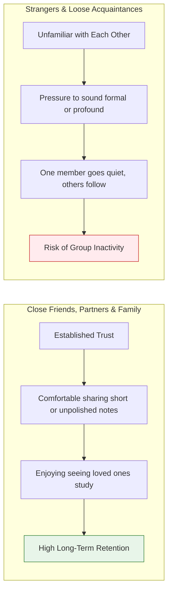

# Small Group Dynamics (Max 5) & Peer Accountability

Scripture Habit's group system is built around a **strict maximum of 5 members per group (`maxMembers: 5`)**.

Furthermore, observations from production usage have shown that **groups composed of close friends, romantic partners, or family members tend to maintain high retention over time, whereas groups formed among strangers or loose acquaintances often struggle to stay active.**

This document explores why the 5-member limit is effective for daily habit formation, and how relational context influences long-term engagement.

---

## 1. Why Cap Groups at 5 Members?

While many social platforms support large groups with dozens or hundreds of members, large group sizes present several challenges for daily personal reflection and habit building:

### ① Mitigating Social Loafing (The Ringelmann Effect)
As group size increases, individual sense of responsibility often decreases because people assume their contribution won't make much difference to the whole.
In a large chat, skipping a day easily goes unnoticed. **In a 5-person circle, each member's presence matters, providing natural, positive peer accountability.**

### ② Reducing the Bystander Effect
In crowded chatrooms, people frequently wait for someone else to respond, resulting in collective silence.
In a small group of 5, members naturally feel more involved, making it easier to share reactions, cheers, and words of encouragement.

### ③ Staying Within Close Relational Capacity (Dunbar's Number)
Anthropological research suggests that the number of people with whom an individual can maintain close, unpretentious relationships is around 5 (the "Support Clique").

---

## 2. The Influence of Pre-Existing Relationships on Retention

In practice, **the relationship between group members is a key factor in how long a group remains active**:

### ① Why Close Friend and Family Groups Last
- **Psychological Safety**:
  Close friends and partners don't worry about being judged for short or simple notes. A quick one-sentence reflection can be shared without hesitation.
- **Mutual Encouragement**:
  Seeing someone you care about study daily serves as natural motivation: *"If they found time today, I'd like to read as well."*

### ② Challenges Faced by Groups of Strangers
- **Pressure to Sound Formal**:
  When sharing with strangers, people often feel the need to write well-composed essays, which raises the friction of posting.
- **Cascading Inactivity**:
  If one stranger stops posting, others may conclude that the group is inactive and gradually stop posting as well.

---

## 3. Product Strategies in Scripture Habit

To support healthy group interaction, Scripture Habit incorporates several design choices:

| Mechanism | Purpose |
| :--- | :--- |
| **Strict 5-Member Cap (`maxMembers: 5`)** | Keeps groups intimate so every member's participation is recognized. |
| **Direct Invite Links** | Makes it easy to invite a spouse, close friend, or family member to study together. |
| **AI Partner Bot in Groups** | In newly formed or smaller groups, the AI bot posts daily to keep the group welcoming and active. |
| **Unity Sync (Team Participation)** | Focuses on shared completion percentage rather than competitive individual rankings. |
| **Inactivity Auto-Kick** | Gently removes inactive members over time so groups remain fresh and active. |

---

## 4. Summary

Building a lasting habit depends not just on individual willpower, but on **the people sharing the journey**.

Scripture Habit is designed not as a large public network, but as a **supportive, comfortable space for up to 5 people** to encourage each other along the way.

---

## 5. Related Documentation

- [Psychological Impact & Retention of AI Reflection Letters](./ux-ai-reflection-letters.md)
- [Milestone Celebrations & Retention Psychology](./logic-milestone-retention.md)
- [Group Chat Construction Guide](./groupchat-construction-guide.md)
- [Group Invites & Joining Pipeline](./group-invites.md)
- [Inactivity & Auto-Kick Engine](./inactivity-and-autokick.md)
- [Unity & Daily Participation](./unity-participation.md)
