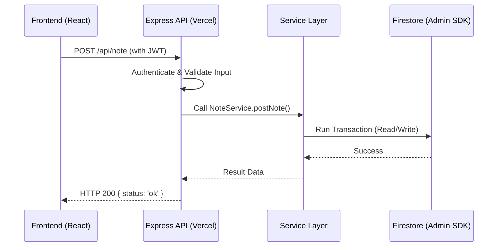
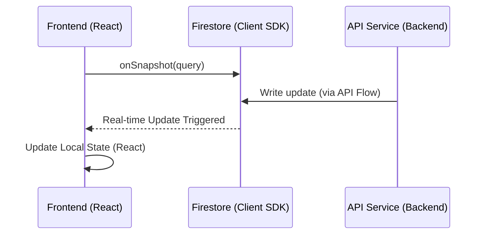
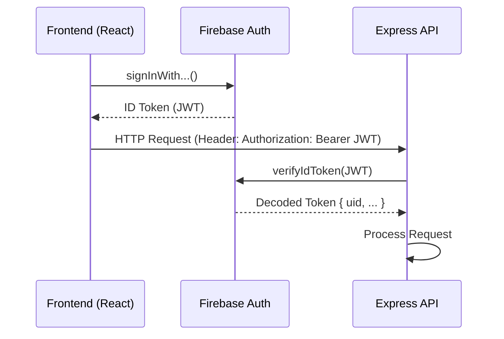

# Project Structure & Architecture

This document strictly defines the directory structure, architectural layers, and data flow conventions for the **scripture-habit** project. All contributors must adhere to these patterns to ensure consistency and maintainability.

---

## 📂 Directory Overview

### Root Level (Configurations)
- `/`: Project-wide settings (Git, IDE, end-of-sprint reports).
- `scripture-habit/`: Main application folder.
  - `.firebase/`, `firebase.json`, `firestore.rules`: Firebase configuration and security.
  - `capacitor.config.ts`, `android/`: Mobile app configuration (Capacitor).
  - `package.json`, `vite.config.ts`: Dependency management and build settings.

### Application Layers (within `scripture-habit/`)
- `api/`: Public API Entry Point. Contains the Express app definition for Vercel/Node deployments.
- `api_internal/`: **The Core Backend**. Private business logic, services, and route handlers.
- `backend/`: Standalone backend scripts or Google Cloud Functions logic.
- `src/`: **The Frontend**. React (Vite) source code.
- `types/`: Global/shared TypeScript definitions (mainly Firestore models).

---

## 🏗️ Backend Architecture (`api` & `api_internal`)

The backend follows a **Controller-Service-Library** pattern:

1.  **Entry Point (`api/api.ts`)**: Initializes Express, CORS, Helmet, and mounts routes.
2.  **Routes (`api_internal/routes/`)**: HTTP controllers that handle requests, validate input (Zod), and call services.
3.  **Services (`api_internal/services/`)**: Pure business logic and database interactions (Firestore Admin SDK).
4.  **Lib (`api_internal/lib/`)**: Shared utilities like `firebase-admin`, `middleware`, `i18n`, and `search-utils`.

### Authentication Middleware
All protected routes use `verifyAppCheck` and `authenticate` (JWT) from `api_internal/lib/middleware.ts`.

---

## ⚛️ Frontend Architecture (`src/`)

The React frontend is organized by function and feature:

- `components/`: Reusable UI components (buttons, modals, shared layouts).
- `groups/`: **Feature Folder**. Contains logic and components specifically for the Group/Chat feature.
- `context/`: React Context providers (Auth, Theme, Settings).
- `hooks/`: Custom hooks for data fetching, synchronization, and complex UI logic.
- `store/`: Lightweight state management (e.g., Zustand for modals).
- `utils/`: Frontend-specific utility functions.
- `types/`: Frontend-only types and Zod schemas for form validation.

---

## 💾 Type Management

We maintain a strict separation between database models and UI-only types:

- **Global Types (`/types`)**: Define the authoritative structure of data stored in Firestore.
- **Frontend Types (`/src/types`)**: Define schemas for forms, API responses, and UI-specific state.

---

## 🔄 Data Flow Visualization

### 1. API Flow (Mutations & Heavy Reads)
Used for data-intensive operations, cross-collection updates, and AI features.

### 2. Real-time Flow (Queries & Updates)
Used for chat messages, group active counts, and live notifications via Firebase SDK.

### 3. Authentication Flow

---

## 📝 Coding Conventions

1.  **Strict Transactionality**: All service methods that update multiple Firestore documents MUST use `db.runTransaction`.
2.  **Explicit Naming**: 
    - Services: `XService.doSomething()`
    - Hooks: `useX()`
    - Components: PascalCase (`GroupCard.tsx`)
3.  **I18n Compliance**: Use the `t()` helper from `api_internal/lib/i18n.ts` for all backend-generated strings (e.g., system messages).
4.  **No Direct DB Write in Frontend**: Prefer calling the API for updates that affect business logic (streaks, counts, notifications) rather than writing directly via Firebase Client SDK.
