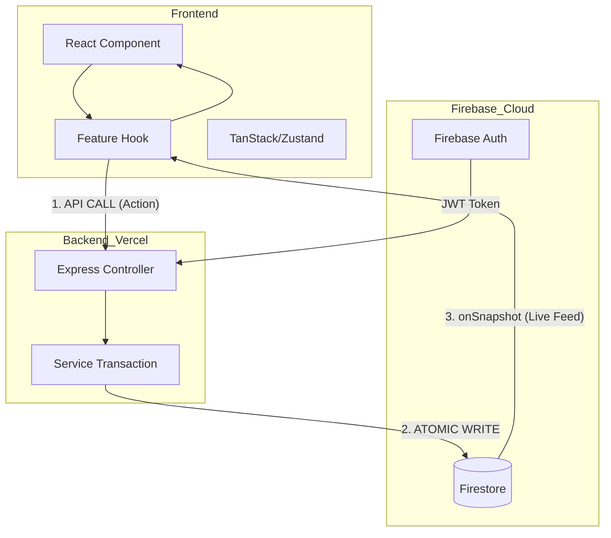

# Technical Architecture Reference

This document provides a deep-dive into the technical foundations of the **scripture-habit** project, covering the tech stack, component design, data flow, and cross-platform architecture.

---

## 🛠️ Technical Stack

We utilize a modern, type-safe stack designed for rapid development and high performance on both web and mobile.

### Frontend
- **Framework**: **React 19** (Concurrent Rendering, specialized Server Actions ready).
- **Build Tool**: **Vite 7** (Lightning-fast HMR and optimized production bundles).
- **Navigation**: **React Router 7** (Handling deep-linking and layout nesting).
- **Data Fetching**: **TanStack Query 5** (Server state management, caching, and retry logic).
- **State Management**: **Zustand** (Lightweight, non-context global UI state).
- **Real-time**: **Firebase 12 Client SDK** (Firestore onSnapshot, Auth, Analytics).

### Backend
- **Platform**: **Node.js** with **Express** (Hosted as Vercel Functions).
- **Database**: **Cloud Firestore** (NoSQL, document-based, real-time).
- **Authentication**: **Firebase Admin SDK** (JWT verification, secure user management).
- **AI Engine**: **Gemini 3.1 Flash-Lite** (Automated translations, recaps, and questions).

### Mobile Bridge
- **Platform**: **Capacitor 8** (Native Webview bridge).
- **Plugins**: Google Auth, Push Notifications, AppCheck, Local Storage.

---

## 🏗️ Architectural Layers

### 1. The Schema Layer (`/types`)
**Centralized Truth**: All Firestore document models are defined as TypeScript interfaces in the root `types/` folder. This ensures that the Backend (Admin SDK) and Frontend (Client SDK) always use identical data structures.

### 2. The Logic Layer (Custom Hooks)
We follow a **"Logic-Component Split"** philosophy:
- **Components**: Responsible for layout, styling (Vanilla CSS), and rendering.
- **Hooks**: Responsible for API calls, data synchronization, and business logic (e.g., `useChatDataSync`, `useNoteSubmission`).
- **Benefit**: Components remain readable and unit-testable, while logic is reusable across different views.

### 3. The Backend Service Layer (`api_internal/services`)
Routes are thin controllers. All heavy lifting (transactions, streak calculations, notifications) is encapsulated in **Services**:
- **`NoteService`**: Handles the atomic note-posting transaction.
- **`StreakEngine`**: Internal logic for calculating 36-hour grace periods.
- **`ArchiveService`**: Manages bucket-based message archiving.

---

## 💾 State Management Taxonomy

We categorize state by its source and persistence to avoid "prop-drilling" and redundant renders.

| State Category | Tool | Purpose |
| :--- | :--- | :--- |
| **Server State** | TanStack Query | Caching API responses, handling loading/error states for metadata. |
| **Real-time State** | Firestore SDK | Synchronized chat messages, unread counts, and group activity. |
| **Global UI State** | Zustand | Managing modals, sidebar visibility, and persistent theme settings. |
| **Auth State** | AuthContext | Standardizing the `currentUser` object across all components. |

---

## 🔄 Data Flow: The Synchronized Loop

Our architecture separates **Mutations** (API) from **Queries** (Direct DB Listeners).

---

## 🌎 Cross-Platform Bridge (Capacitor)

The mobile application is a high-performance Webview running our Vite build.

- **Bridge Communication**: Standard JS `fetch` calls are intercepted by the Capacitor bridge for secure network access.
- **Native Persistence**: Using native storage for cached user preferences to speed up initial boot.
- **LiveReload workflow**: During development, the Android/iOS app points directly to the Vite dev server (`http://[local-ip]:5173`), allowing for "Save-and-See" updates on physical devices.

---

## 🛡️ Reliability & Security
- **Type Guards**: `firestoreConverters.ts` uses Zod to ensure that malformed data in Firestore is caught and normalized before it crashes the UI.
- **Error Boundaries**: Component-level boundaries prevent a single error in a chat message from crashing the entire Dashboard.
- **Sentry Integration**: All layers report performance bottlenecks and unhandled exceptions to a centralized Sentry dashboard.
