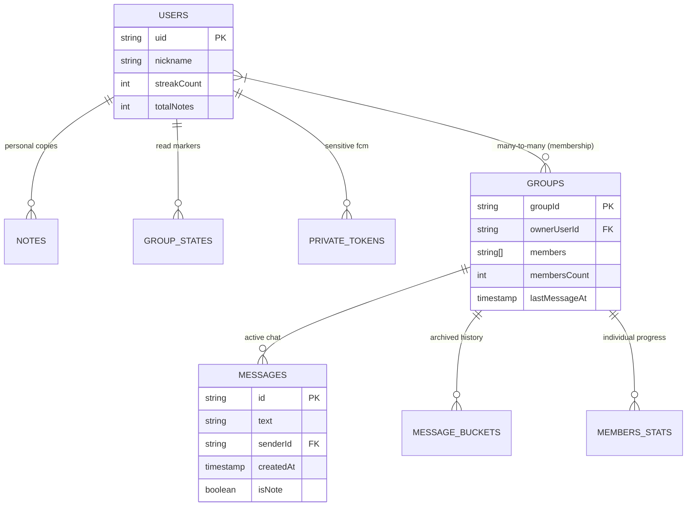

# Database & Security: The Technical Foundation

This document defines the data architecture, security logic, and integrity patterns used to maintain a secure and scalable environment for **scripture-habit**.

---

## 📂 Entity-Relationship (ER) Diagram

Our data model is hierarchical, balancing the need for real-time synchronization with long-term data persistence.

---

## 🗺️ Schema Roadmap

### 1. `groups` (The Center of Gravity)
- **Denormalization**: We store `memberPreviews` (nickname/photo) and `lastMessageAt` directly on the group document to allow for high-performance dashboard rendering without multiple lookups.
- **Activity Tracking**: `dailyActivity` stores a timestamped list of active UIDs to calculate group "Unity" without querying the entire message collection.

### 2. `users` (The Profile & Personal Sync)
- **Shared ID**: The document ID is the Firebase Auth UID.
- **Redundancy**: `groupIds` (array) is maintained to allow for `array-contains` queries when a user needs to see all their groups.

### 3. Subcollections (Granular Data)
- **`messages`**: Optimized for real-time listeners. Kept small via archiving.
- **`members`**: Stores per-group statistics (points, activity counts) that are too large to fit in the main group document.

---

## 🛡️ The "Safety Chain" (Security Logic)

Our `firestore.rules` implements a "Swiss Cheese" model where multiple layers of checks must pass.

### 1. Verification Logic
- **`isAuthenticated()`**: Checks `request.auth != null`. In production, it further validates `request.auth.token.email_verified == true`.
- **`isAppCheckVerified()`**: **The Anti-Abuse Layer.** Every write request must include a valid AppCheck token issued by the Firebase SDK. This prevents direct `curl` or script-based attacks.

### 2. Role-Based Access (RBAC)
- **Member-Only Read**: To read messages, the system uses `isMemberOfGroup(groupId)`. 
  - Implementation: `request.auth.uid in get(/databases/$(database)/documents/groups/$(groupId)).data.members`.
  - This ensures users cannot "peek" into groups they haven't joined.

---

## 💎 Integrity & The "API-Only Write" Policy

To prevent users from manually updating their own streaks, levels, or coins, the following architecture is enforced:

1.  **Frontend Lockdown**: All core collections have `allow write: if false;`.
2.  **Service Actions**: Updates must go through the **Backend API**.
3.  **Atomic Transactions**: The API uses `db.runTransaction()` to ensure that if a note is created, the user's streak and group statistics are updated **simultaneously**. If any part fails, the entire action is rolled back.

---

## 📦 Scalability: The Bucket Pattern

To avoid Firestore's document limits and keep queries fast, we implement the **Bucket Pattern** for chat history.

- **Active Collection**: High-frequency messages are stored in `groups/{id}/messages`.
- **Archiving**: An automated Cron job (`ArchiveService`) moves messages older than 30 days into `groups/{id}/message_buckets/{bucketId}`.
- **Result**: The "active" chat remains lightweight, ensuring that `onSnapshot` listeners don't consume excessive bandwidth or memory on mobile devices.

---

## 🔐 Private Data Isolation

Sensitive information like FCM tokens for push notifications are stored in:
`users/{uid}/private/tokens`

- **Rule**: `allow read, write: if request.auth.uid == userId;`
- **Isolation**: Not even group members or group owners can see these tokens. Only the user and the **Service Account (Admin SDK)** have access.
