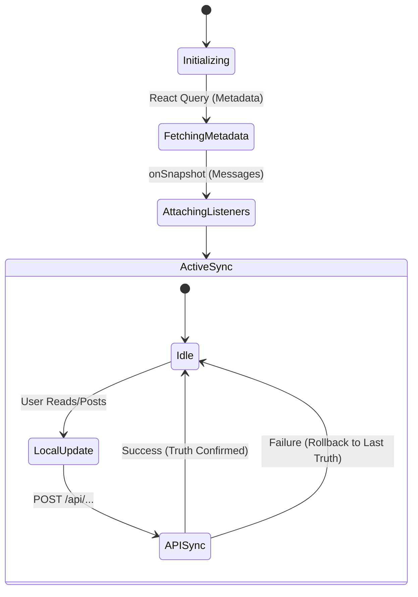

# Chat & Dashboard: The Real-time Sync Engine

The **Chat Dashboard** is the most complex UI component in **scripture-habit**. It must handle dozens of real-time messages, image uploads, and unread status markers across multiple groups simultaneously without flickering or UI lag.

---

## 🛰️ Real-time Core: `onSnapshot` Architecture

We avoid traditional "Pull" (polling) or "Manual Fetch" patterns. Instead, the UI is a direct reflection of the Firestore database via persistent WebSocket listeners.

### Delta Handling
The sync engine (primarily through `useChatDataSync.ts`) utilizes Firestore's ability to send only "Modified" or "Added" documents.
- **Optimistic State**: When a user reads a message, the UI updates local state immediately while the API update processes in the background.
- **Snapshot Merging**: New messages are appended to the local list, ensuring that deep tree re-renders are minimized by using stable React `key` properties based on Firestore `doc.id`.

---

## 🏁 Race Condition Prevention: Read Markers

Synchronizing "Unread Counts" is a classic distributed systems problem. We solve it using a **"Server-Side Truth"** model:

1.  **Local Read**: When a user enters a chat, the app marks the local `unreadCount` as zero.
2.  **API Sync**: It calls `/api/update-read-status` to inform the server of the new "Last Read" timestamp.
3.  **Healing Logic**: If the API call fails or a background tab conflict occurs, the next `onSnapshot` trigger from the server will "heal" the local state by overwriting it with the absolute truth from the database.

---

## 🖼️ Media & Image Handling

Images in the chat follow a multi-stage lifecycle to ensure the UI feels responsive:
- **Optimization**: Images are resized/compressed on the client using `sharp`-like logic before upload to save user bandwidth.
- **Storage**: Real-time URLs are generated via Firebase Storage.
- **Optimistic Preview**: The component displays a local blob URL instantly after the user selects an image, replacing it with the permanent URL only once the upload is confirmed.

---

## 🚦 Synchronization State Diagram

---

## 🚀 Performance Tips for Developers
- **Limit Snapshots**: Always use `limit(N)` and `orderBy('createdAt', 'desc')` in chat queries to prevent loading thousands of historical messages.
- **Stable References**: Use `useMemo` for derived chat data to prevent the sidebar from re-rendering on every typing event.
- **Background Suppression**: When the browser tab is inactive, the listeners remain active but computationally heavy UI updates are throttled to save CPU.
