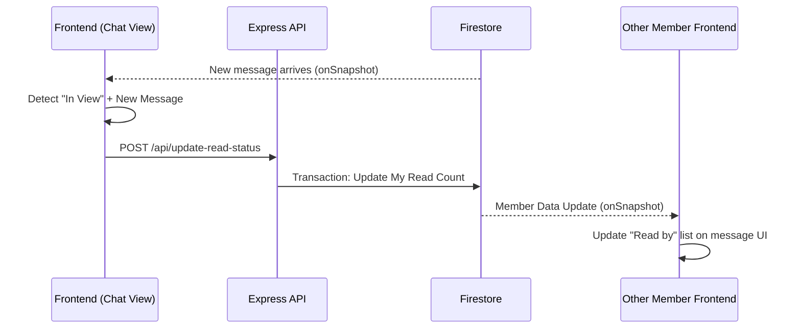

# Group Chat & Dashboard: Deep-Dive Documentation

This document provides a technical deep-dive into the structure, data flow, and Firebase synchronization mechanisms of the two core features of **scripture-habit**: the Dashboard and the Group Chat.

---

## 🏗️ Architectural Overview

The application is built on a "Reactive State & Authoritative Write" model:
- **Reactive State (Snapshots)**: The UI listens directly to Firestore using `onSnapshot` for immediate, real-time updates.
- **Authoritative Write (API)**: Complex mutations (posting notes, updating streaks, changing group settings) are performed via the Express API using the Firebase Admin SDK to ensure transactionality and security.

---

## 📊 Dashboard Synchronization

The Dashboard acts as the control center, coordinating multiple data streams.

### 1. `useDashboardSync` (Profile & Maintenance)
- **Auth Sync**: Listens to the current user's profile.
- **Self-Healing (Migration)**: Automatically recalculates and "fixes" user statistics (like `daysStudiedCount`) if they appear inconsistent with the underlying note data.

### 2. `useDashboardGroups` (The Group Engine)
- **Unified Listener**: Maintains a single listener on the `groups` collection for all groups the user is a member of.
- **Member Status Listeners**: Attaches individual listeners to the `/members/{uid}` subcollection for every group to track personal status (e.g., last read time, activity status).
- **Badge Reset**: In the dashboard view, unread counts are managed globally to prevent UI noise.

---

## 💬 Group Chat Core Architecture

The Group Chat is a high-performance feature designed for low latency and high consistency.

### 1. `GroupChatProvider` (Context Hub)
Everything within the chat view is wrapped in this provider. It orchestrates dozens of hooks (~20+) and provides four specialized contexts:
- `Data`: Messages, Members, Group Meta.
- `Interaction`: Replies, Edits, Context Menus, Scroll state.
- `UI`: Modal visibility, Tooltips.
- `Actions`: Handlers for all user inputs.

### 2. `useChatDataSync` (The Data Engine)
The core logic resides here, separated into sub-sync hooks:
- **Bundle Hydration**: Uses Firestore "Bundles" (via `/api/bundle/{id}`) to boost initial load performance by loading the most recent messages in a single binary chunk.
- **Message Stream**: Swaps from the bundle to a live `onSnapshot` listener (limited to the last 50 messages) for real-time reactivity.
- **Member Cache**: Dynamically fetches and caches profiles of reactors or senders not in the main member list.

---

## 🔄 The "Unread Sync" Mechanism

Synchronizing read status is the most complex part of the app. It ensures that "Read by X" indicators are accurate across all devices.

### Flow: Marking as Read
1.  **Detection**: `useUserReadStateSync` (inside the chat hook) detects when the user is viewing the chat and new messages have arrived.
2.  **Comparison**: It compares the `groupData.messageCount` (from metadata) with the user's `readMessageCount` (from `users/{uid}/groupStates/{gid}`).
3.  **Local Update**: The hook optimistically updates a local React state to 0 unread messages for instant UI feedback.
4.  **Backend Sync**: It calls the `/api/update-read-status` endpoint.
5.  **Authoritative Write**: The API uses a Firestore Transaction to:
    - Update `users/{uid}/groupStates/{gid}`.
    - Update `groups/{gid}/members/{uid}` (so others see "Read by you").
    - Update `groups/{gid}` metadata if necessary.

### Visualization: Read Status Loop

---

## 📡 Firebase Integration Details

### 1. Firestore Converters (`utils/firestoreConverters.ts`)
We use `FirestoreDataConverter` combined with **Zod Schema validation**. 
- **Validation**: Incoming data is parsed through Zod to catch field type errors immediately.
- **Normalization**: Legacy data formats (e.g., old scripture categories) are normalized to modern formats on-the-fly.

### 2. Persistence
The app uses `persistentLocalCache` with `persistentMultipleTabManager` to ensure that data remains available offline and synchronized across multiple browser tabs without redundant network requests.

---

## 💡 Key Design Decisions

- **Why API for Read Status?**: We use an API call rather than a client-side write to ensure that read-status updates are bundled with other side-effects (like calculating attendance or triggering bots) and because client-side security rules for updating metadata can be overly complex.
- **Scroll Management**: The `useScrollManager` uses a "Scroll Lock" logic to prevent the view from jumping when new messages arrive while the user is reading history.
- **Hydration Boost**: By fetching a pre-calculated bundle of the last 50 messages, we avoid the initial "empty state -> loading -> pop-in" flicker common in real-time apps.
