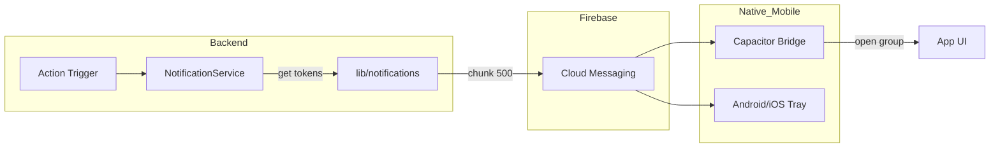

# Notification System: Delivery Reliability

The **Notifications Subsystem** ensures that the "social pressure" of the habit loop works effectively by delivering real-time alerts when group members post notes or achieves milestones.

---

## 🔑 Dual Token Strategy

We store FCM tokens in two locations to maximize deliverability while maintaining privacy:
1.  **Public Site (`users/{uid}/fcmTokens`)**: Fast access for multicast group notifications.
2.  **Private Vault (`users/{uid}/private/tokens/fcmTokens`)**: Fallback for more sensitive system alerts.

During notification delivery, the `getUserFcmTokens` helper aggregates and unique-ifies tokens from both locations.

---

## ⚡ Multicast Sending & Chunking

Firestore messaging supports high-volume sending, but it has a 500-token limit per request. Our `sendPushNotification` utility implements **Automatic Chunking**:

- **Chunk Size**: 500 tokens.
- **Multicast Loop**: If a group has 2,000 active tokens across all members, the system automatically performs 4 optimized parallel requests.
- **`sendEachForMulticast`**: We use the latest Firebase Admin SDK method which provides granular success/failure reports for *each individual token* within the chunk.

---

## 🧹 Self-Healing Token Lifecycle

Ghost tokens (tokens for uninstalled apps or expired devices) cause latency and unnecessary API load. We implement a **Self-Healing Loop**:

1.  **Detection**: The Admin SDK reports `messaging/invalid-registration-token`.
2.  **Capture**: The failed tokens are extracted from the multicast response.
3.  **Traceability**: The `tokenToUserMap` identifies which User ID owns the failed token.
4.  **Pruning**: `cleanupTokens` removes the failed token from both the Public and Private Firestore locations.

---

## 📦 Payload Architecture: Notification vs. Data

Every push we send is a "Hybrid Payload" to ensure best compatibility across Android and iOS.

| Key | Purpose | Logic |
| :--- | :--- | :--- |
| **`notification`** | **Visual** | Handled by OS. Displays title and body even if app is closed. |
| **`data`** | **Programmatic** | Handled by Capacitor. Includes `groupId` and `type` for deep-linking. |

### Foreground Suppression
If the app is open (foreground), we often suppress the visual notification banner because the **real-time `onSnapshot` listener** already shows the content in the chat. This prevents redundant information overload.

---

## 🚦 Communication Flow Diagram

