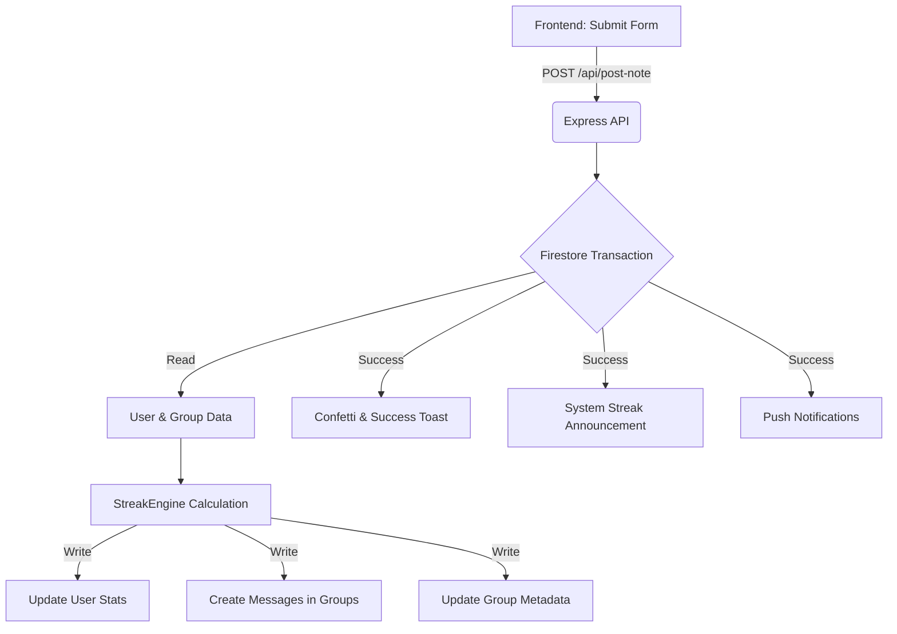

# Note Posting Mechanism: Detailed Documentation

This document explains the end-to-end flow of posting a note in **scripture-habit**, covering calculations, database transactions, and real-time synchronization.

---

## 1. Frontend Phase (`src/components/newnote/`)

### User Interaction
1.  **Form Input**: User selects a scripture category, enters a chapter/URL, and writes a comment.
2.  **Validation**: `useNoteSubmission` ensures mandatory fields are filled. It enforces URL requirements for specific categories like "General Conference".
3.  **Submission**: On clicking "Post", `useNoteSubmission` triggers an API request to `/api/post-note`.

### API Request Payload
```json
{
  "chapter": "John 3:16",
  "comment": "God so loved the world...",
  "scripture": "New Testament",
  "shareOption": "all",
  "timeZone": "Asia/Tokyo",
  "language": "ja",
  "optimisticId": "..."
}
```

---

## 2. Backend Transaction Phase (`api_internal/services/NoteService`)

The backend processing is wrapped in a **strict Firestore Transaction** to ensure atomicity.

### Step A: Dependency Reads
The service reads current state before any writes:
- **User Document**: Fetches `streakCount`, `highestStreak`, `lastPostDate`, and `groupIds`.
- **Group Documents**: Fetches metadata for all groups the user belongs to (up to a limit of 20).

### Step B: The Calculation Core (`StreakEngine`)
The `StreakEngine` determines if the streak should increment, reset, or stay the same:
- **Today/Yesterday Logic**: Calculated based on the provided `timeZone`.
- **36-Hour Grace Period**: A post is considered "consecutive" if it's within **36 hours** of the last post, or if it's on the calendar "yesterday". This handles life's delays more gracefully than a strict calendar day.
- **Level Calculation**: Level is derived from `daysStudiedCount`.
  - 公式: `Level = floor(daysStudiedCount / 7) + 1`
  - (例: 7日勉強するごとにレベルが1上がります)

### Step C: Atomized Writes
The transaction executes all writes simultaneously:
1.  **User Stats Update**:
    - `lastPostAt`: Current server time.
    - `daysStudiedCount`: +1 (if a new day).
    - `streakCount`: Updated based on `StreakEngine`.
    - `highestStreak`: Updated if `newStreak > currentHighest`.
2.  **Message Creation**: A new message document is created in `groups/{gid}/messages/`.
3.  **Group Metadata Update**:
    - `lastMessageAt`: Current time.
    - `messageCount`: +1.
    - `noteCount`: +1.
    - `memberLastActive.{uid}`: Updated to track inactivity.
4.  **Read Status Sync**: The user's `groupStates/{gid}.readMessageCount` is set to the current `messageCount` so the sender sees 0 unread.
5.  **Personal Note**: The note is saved to `users/{uid}/notes/`.

---

## 3. Synchronization & Side Effects

### Real-time UI Propagation
- **Sender**: Receives a success 200 OK, triggers **Confetti** and a Toast notification. The `useDashboardGroups` listener picks up the metadata change instantly.
- **Group Members**: Their `onSnapshot` listeners on `groups/{gid}/messages` trigger, showing the new note immediately.

### Streak Announcements (System Messages)
If the user's streak was updated and is > 0, the system automatically posts an "announcement" message to all groups:
- **Message Type**: `streakAnnouncement`.
- **Content**: "[User] has reached a [N] day streak! 🔥" (localized).

### Push Notifications
`NotificationService.notifyNotePosted` is called outside the transaction (post-success):
1.  Fetches tokens for all group members (excluding the sender).
2.  Sends an FCM (Firebase Cloud Messaging) payload with the note preview.

---

## 🔄 Data Flow Summary



---

## 💎 Critical Synchronization Logic

### 1. Inactivity Protection
Each note post updates `memberLastActive.{uid}` in the group metadata. This is used by a separate background "Auto-Kick" logic to determine if a member has been inactive longer than the group's threshold.

### 2. Note-Message Linking
The message in the group contains `originalNoteId`. If the user edits their note later, the system uses this ID to synchronize changes across all shared groups.
