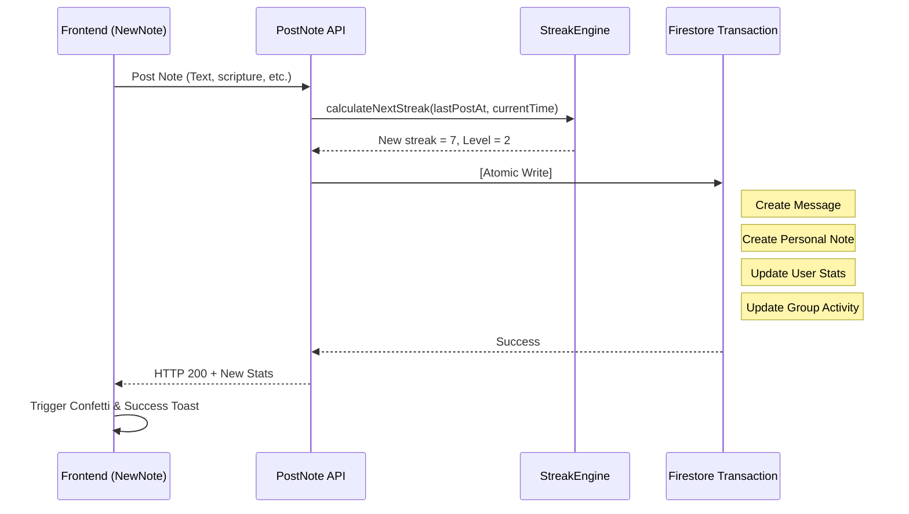

# Note Posting & Streak Logic: Technical Deep-Dive

The Note Posting mechanism is the heart of the "Habit" loop in **scripture-habit**. It is designed to be fair, encouraging, and highly reliable across timezones.

---

## 🔥 The Streak Engine (`api_internal/lib/streak-engine.ts`)

We use a unique **36-hour window** logic to calculate streaks, rather than a strict 24-hour calendar day.

### The Algorithm
1.  **Timezone Normalization**: The system takes the user's `timeZone` and `lastPostAt` timestamp.
2.  **Grace Period**: 
    - A streak continues if a new note is posted within **36 hours** of the last note.
    - This allows users to post late at night one day and early the next morning without losing progress, or miss a full calendar day due to travel/timezone shifts.
3.  **Calculation**:
    ```typescript
    // Pseudocode
    if (diffMs < 36 * 3600 * 1000) {
       streak += 1; // Or stays the same if posted twice in 24h
    } else {
       streak = 1; // Reset
    }
    ```

---

## 💎 The Post Transaction (Atomic Steps)

To ensure data integrity, every note post is wrapped in a `db.runTransaction()`. The following **6 steps** happen at once:

1.  **Validate**: Ensures the user is a member of the target group.
2.  **Calculate Stats**: Invokes `StreakEngine` to determine the new `streakCount` and `level` (based on `daysStudiedCount`).
3.  **Create Message**: A new document is written to `groups/{id}/messages` containing the note content.
4.  **Sync Personal Note**: A duplicate is written to `users/{uid}/notes` for long-term personal storage.
5.  **Update User Profile**: Atomic increment of `totalNotes` and updates to `lastPostAt`, `streakCount`, and `level`.
6.  **Metadata Update**: Updates `lastMessageAt/Nickname` and `lastNoteAt/Nickname` on the main group document to trigger real-time sidebar updates.

---

## 🤝 Group Unity Logic (`dailyActivity`)

The "Unity" bar in the group chat reflects collective effort for the current calendar day (UTC).
- **Active Members**: During the transaction, the user's UID is added to the group's `dailyActivity.activeMembers[]` array.
- **Deduplication**: The array is unique; posting multiple times in one day only counts as one "Unity point" per member.
- **Reset**: The cron job OR the first post of a new UTC day resets the `dailyActivity` object.

---

## 🏆 Level Derivation

Level is a derived value calculated as follows:
`Level = floor(daysStudiedCount / 7) + 1`

- **Why 7?**: We use a weekly cadence. Completing 7 distinct days of study (regardless of streaks) earns you a new level.
- **Persistence**: While it's a derived value, we persist it to the `users` document to allow for high-performance sorting in leaderboards and profiles.

---

## 🚦 Posting Flow Diagram


